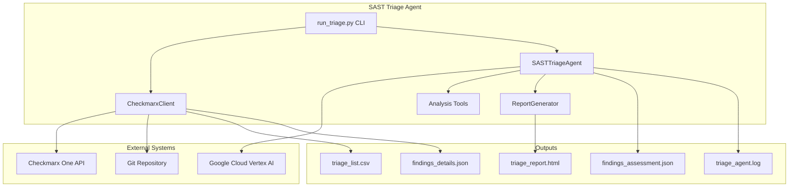
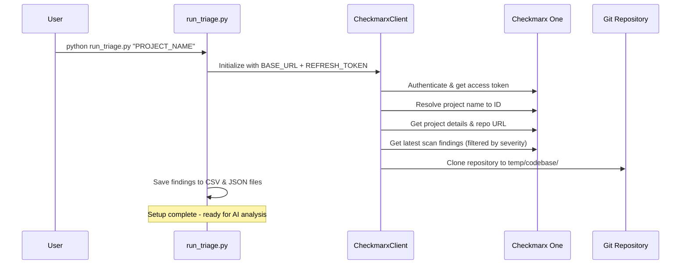
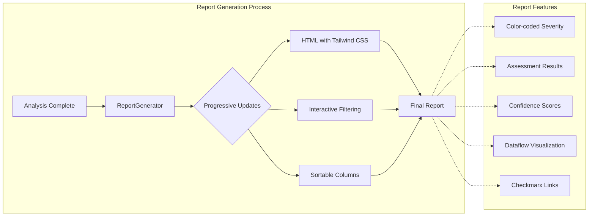
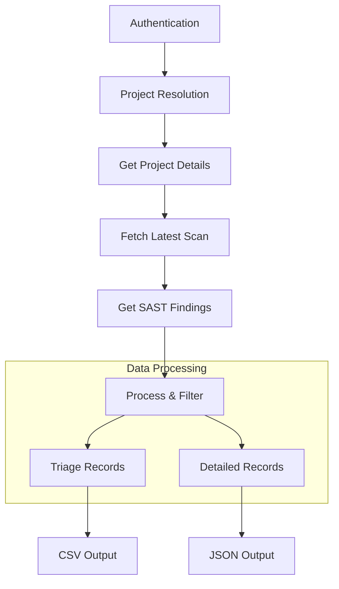

# SAST Triage Agent - Functional Architecture Diagram

## Overview
The SAST Triage Agent is an AI-powered system that automatically analyzes Static Application Security Testing (SAST) findings from Checkmarx One to determine their exploitability. It uses LangChain agents with Vertex AI (Gemini) to perform thorough security analysis.

## High-Level Architecture



## Detailed Functional Flow

### Phase 1: Data Collection & Setup



### Phase 2: AI-Powered Analysis

```mermaid
sequenceDiagram
    participant CLI
    participant Agent as SASTTriageAgent
    participant AI as Vertex AI (Gemini)
    participant Tools as Analysis Tools
    participant FS as File System

    CLI->>Agent: process_all_findings()
    loop For each untriaged finding
        Agent->>Agent: Load finding details from JSON
        Agent->>AI: Send system prompt + finding details

        loop Analysis iterations (max 15)
            AI->>Tools: Use tools to investigate
            alt read_file
                Tools->>FS: Read source code file
                FS-->>Tools: File content with line numbers
            else search_in_files
                Tools->>FS: Search pattern across codebase
                FS-->>Tools: Matching lines and locations
            else list_directory
                Tools->>FS: List directory contents
                FS-->>Tools: Files and directories
            else submit_triage_decision
                Tools->>Agent: Final decision submitted
                break
            end
            Tools-->>AI: Tool results
            AI->>AI: Analyze and plan next step
        end

        Agent->>Agent: Save result to findings_assessment.json
        Agent->>CLI: Update CSV (mark as triaged)
        Agent->>CLI: Add to HTML report
    end
```

### Phase 3: Report Generation



## Core Components Deep Dive

### 1. SASTTriageAgent (sast_triage/agent.py)

**Purpose**: Main orchestrator using LangChain framework

**Key Capabilities**:
- Initializes Vertex AI ChatVertexAI model (Gemini 2.5 Flash)
- Manages conversation flow with system prompts
- Coordinates tool usage for investigation
- Handles iterative analysis (max 15 iterations per finding)
- Generates structured TriageDecision outputs

**Core Tools Available to AI**:
```python
tools = [
    read_file,          # Read complete source files
    search_in_files,    # Pattern search across codebase
    list_directory,     # Explore project structure
    submit_triage_decision  # Submit final assessment
]
```

### 2. Analysis Tools (sast_triage/tools.py)

**Security-First Design**:
- Path traversal protection via `validate_safe_path()`
- All file operations scoped to codebase directory
- Input validation and error handling

**Tool Details**:

#### `read_file(file_path: str)`
- Reads complete files with line numbers
- No size limits (Gemini has large context)
- Security: Prevents directory traversal

#### `search_in_files(pattern: str, file_extension: str)`
- Regex pattern search across files
- Recursive search with configurable limits
- Returns file paths, line numbers, and content

#### `list_directory(directory_path: str)`
- Explores project structure
- Returns files/directories with metadata
- Helps AI understand codebase organization

#### `submit_triage_decision(is_exploitable: bool, confidence: float, justification: str)`
- Final decision submission tool
- Validates confidence scores (0.0-1.0)
- Converts to structured TriageDecision format

### 3. Checkmarx Integration (sast_triage/api/checkmarx_client.py)

**API Operations**:


**Key Features**:
- OAuth token refresh mechanism
- Branch-specific scan retrieval with fallback
- Severity filtering (HIGH, MEDIUM, etc.)
- Pagination for large result sets
- SSL certificate support for enterprise environments

### 4. Security Analysis Approach

**AI System Prompt Strategy**:
```
"You are an experienced senior security analyst evaluating SAST findings..."

Key Directives:
✓ Investigative and thorough approach
✓ Look for evidence, not just follow procedures
✓ Consider real-world exploitability
✓ Be skeptical but fair
✓ MANDATORY tool usage in every response
```

**Analysis Methodology**:
1. **Component Context**: Understand code's role and environment
2. **Data Flow & Trust**: Trace data origins and trust boundaries
3. **Security Controls**: Assess existing mitigations
4. **Exploitation Potential**: Consider attack vectors and impact

**Decision Categories**:
- **CONFIRMED**: True positive, exploitable vulnerability
- **NOT_EXPLOITABLE**: False positive, not exploitable
- **REFUSED**: Insufficient information for determination

### 5. Output Structure

```
output-directory/
├── findings/
│   ├── triage_list.csv         # resultHash, severity, triaged status
│   └── findings_details.json   # Complete Checkmarx data + dataflow
├── codebase/                   # Cloned repository
├── findings_assessment.json    # AI analysis results
├── triage_report.html          # Interactive report
└── triage_agent.log           # Detailed execution log
```

### 6. Data Models (sast_triage/models.py)

**TriageDecision Structure**:
```python
class TriageDecision(BaseModel):
    resultHash: str                    # Checkmarx result identifier
    assessment_result: str             # CONFIRMED|NOT_EXPLOITABLE|REFUSED
    assessment_confidence: float       # 0.0 to 1.0
    assessment_justification: str      # Detailed reasoning
```

## Command Line Interface

### Basic Usage
```bash
python run_triage.py "PROJECT_NAME"
```

### Advanced Options
```bash
# Custom severities
python run_triage.py "PROJECT_NAME" --severities HIGH,CRITICAL

# Specific branch analysis
python run_triage.py "PROJECT_NAME" --branch main

# Custom output directory
python run_triage.py "PROJECT_NAME" --output-dir ./analysis

# Single finding analysis
python run_triage.py "PROJECT_NAME" --finding RESULT_HASH_123
```

## Security Considerations

### Input Validation
- Path traversal protection in all file operations
- Checkmarx result hash validation
- Environment variable validation for API credentials

### API Security
- OAuth token management with automatic refresh
- SSL certificate validation support
- Rate limiting compliance with Checkmarx API

### Code Analysis Security
- AI model temperature set low (0.1) for consistency
- Structured output validation via Pydantic models
- Comprehensive logging for audit trails

## Performance Characteristics

### Scalability
- **Batch Processing**: Handles 100+ findings per scan
- **Incremental Updates**: Progressive report generation
- **Token Optimization**: Efficient prompt engineering
- **Parallel Capable**: Tool operations can run concurrently

### Typical Performance
- **Analysis Time**: 30-60 seconds per finding
- **Context Usage**: ~100K tokens per finding analysis
- **Memory Usage**: Minimal (streams file content)
- **Storage**: ~1MB per 100 findings analyzed

## Configuration Management

### Environment Variables (.env)
```env
# Checkmarx One Configuration
BASE_URL=https://your-checkmarx-instance.com
REFRESH_TOKEN=your-refresh-token

# Vertex AI Configuration
PROJECT_ID=your-gcp-project-id
DEFAULT_LOCATION=europe-west4
MODEL_NAME=gemini-2.5-flash
```

### Configuration Constants (config.py)
- Analysis iteration limits (15 max per finding)
- Search result caps (5000 max)
- Default severities and branches
- Path and file configurations

## Error Handling & Resilience

### Failure Modes
- **API Failures**: Graceful degradation with retry logic
- **AI Analysis Timeouts**: REFUSED classification with timeout reasoning
- **File Access Errors**: Secure error messages without path disclosure
- **Network Issues**: Automatic retry with exponential backoff

### Recovery Mechanisms
- **Incremental Processing**: Resume from last completed finding
- **State Persistence**: All results saved immediately
- **Audit Trails**: Comprehensive logging for debugging

This architecture provides a robust, secure, and scalable solution for automated SAST finding triage using modern AI capabilities while maintaining enterprise security standards.