# SAST Triage Agent - Functional Overview

## Business Problem & Solution

**The Challenge**: Security scanners like Checkmarx generate hundreds of potential vulnerabilities per application scan. Security teams spend 70-80% of their time manually reviewing these findings to determine which ones are actually exploitable and require immediate action.

**The Solution**: An AI security analyst that automatically triages findings, reducing manual effort by 70-80% while maintaining high accuracy and providing detailed reasoning for each decision.

## High-Level Functional Flow

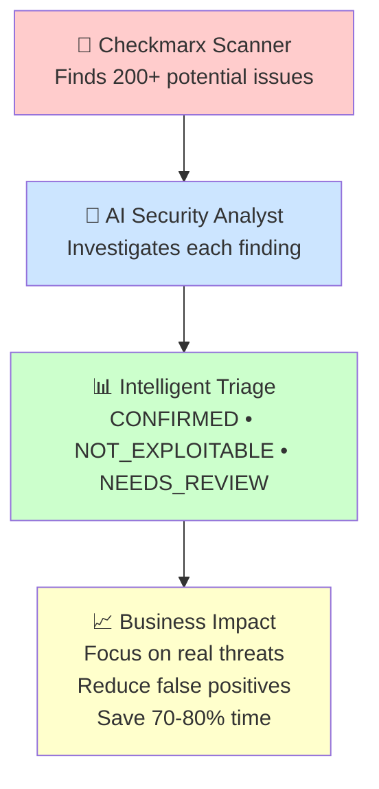

## What the AI Security Analyst Does

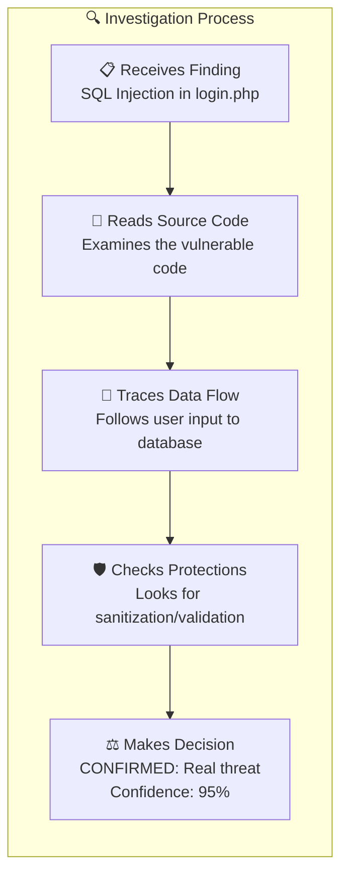

## Business Value Demonstration

### Before AI Triage
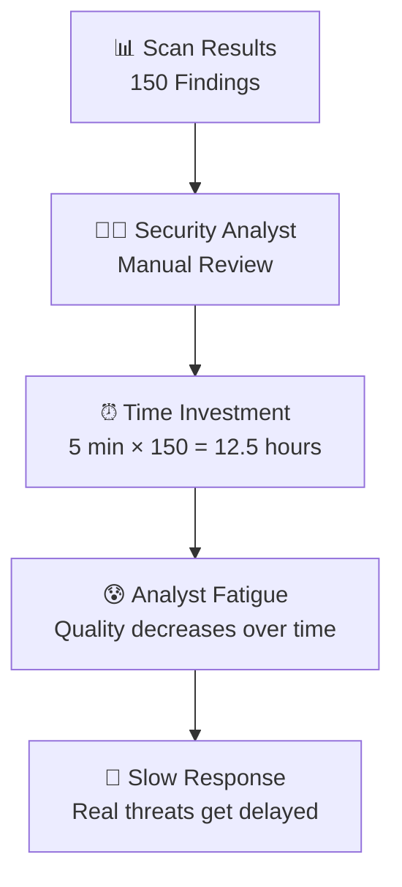

### After AI Triage
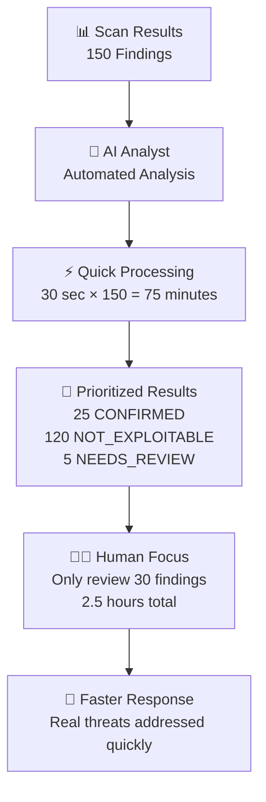

## Functional Components (Business View)

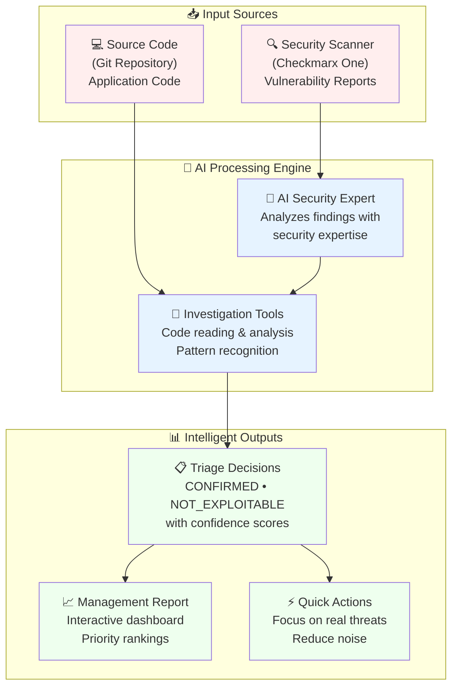

## Real-World Use Cases

### Use Case 1: Weekly Security Review
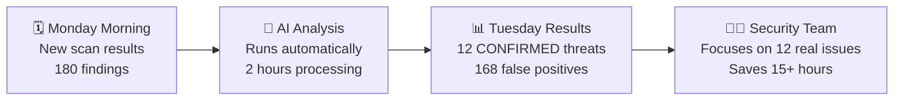

### Use Case 2: Critical Application Assessment
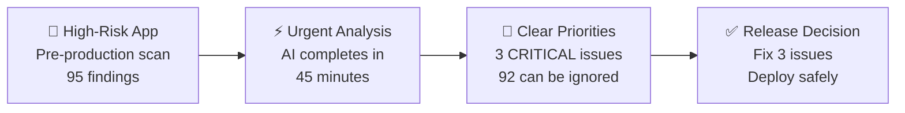

### Use Case 3: Compliance Reporting
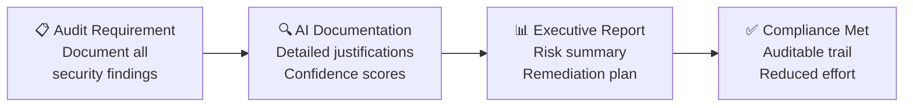

## Decision Making Process

### How the AI Thinks About Security

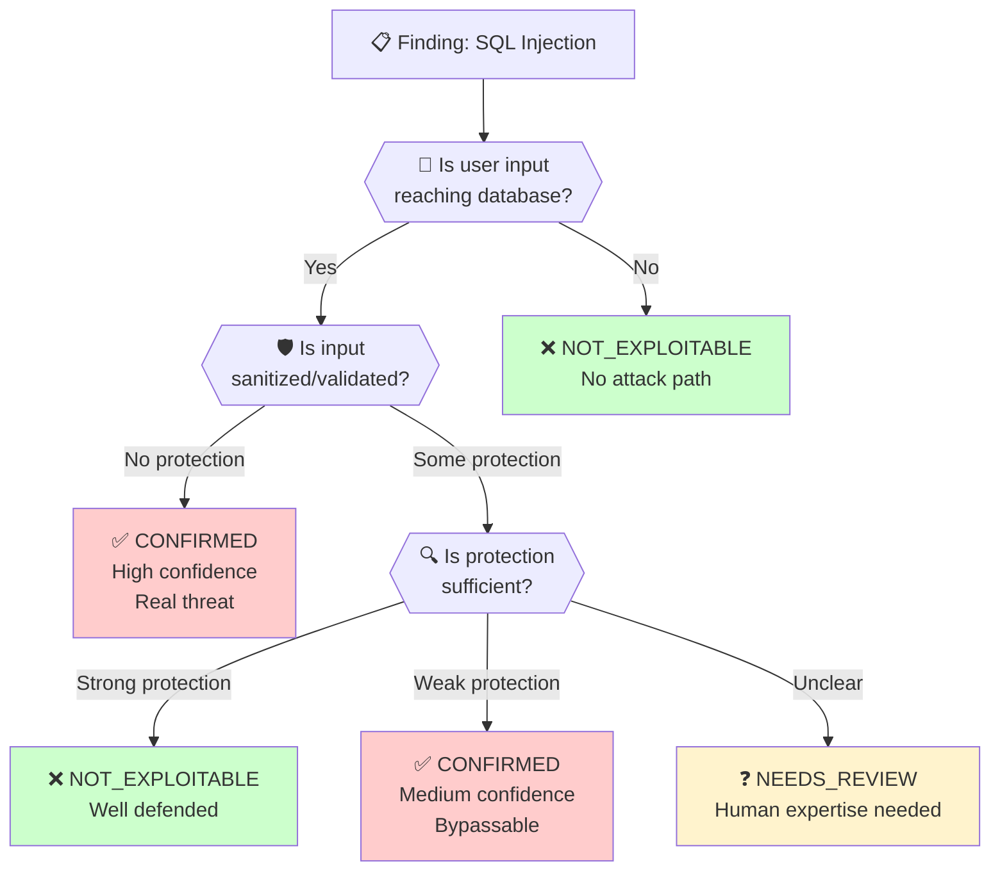

## Business Benefits & ROI

### Quantified Benefits

**Time Savings**: 70-80% reduction in manual triage effort
- **Before**: 5 minutes × 150 findings = 12.5 hours per scan
- **After**: 2 hours AI processing + 2.5 hours human review = 4.5 hours total
- **Savings**: 8 hours per scan = **64% time reduction**

**Quality Improvements**: Consistent analysis without human fatigue
- **Reduced False Negatives**: AI doesn't get tired reviewing finding #150
- **Audit Trail**: Every decision documented with reasoning
- **Consistent Standards**: Same analysis approach for every finding

**Cost Impact**:
- **Personnel Costs**: 8 hours × $75/hour = $600 saved per scan
- **Faster Response**: Critical vulnerabilities identified immediately
- **Risk Reduction**: Fewer real threats slip through due to analyst fatigue

### Success Metrics

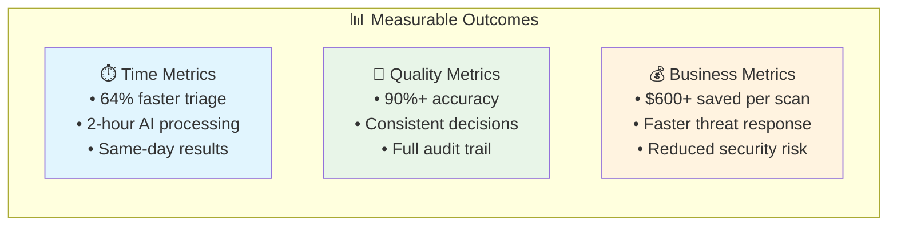

## Implementation Approach

### Getting Started (Business Perspective)

**Phase 1: Proof of Concept (2 weeks)**
- Run AI analysis on historical scan data
- Compare AI decisions with known outcomes
- Measure accuracy and time savings

**Phase 2: Pilot Program (1 month)**
- Deploy on one high-volume application
- Train security team on new workflow
- Fine-tune confidence thresholds

**Phase 3: Full Deployment (3 months)**
- Roll out across all applications
- Integrate with existing security workflows
- Establish success metrics and reporting

### Change Management

**For Security Teams**:
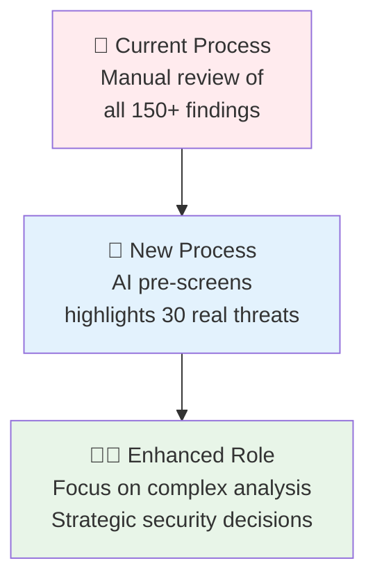

**For Management**:
- **Reduced Costs**: Less manual effort required
- **Faster Response**: Threats identified in hours, not days
- **Better Compliance**: Complete documentation and audit trails
- **Scalability**: Handle volume growth without hiring

## Competitive Advantage

### Why This Approach Works

**🎯 Security Expertise Built-In**:
- AI trained on real security analysis patterns
- Understands vulnerability context, not just patterns
- Considers exploitability, not just potential issues

**🔄 Continuous Learning**:
- Each analysis builds institutional knowledge
- Consistent application of security standards
- Improves over time with feedback

**⚡ Enterprise Ready**:
- Integrates with existing Checkmarx workflows
- Handles enterprise scale (100+ findings per scan)
- Provides audit trails and compliance documentation

### Future Roadmap

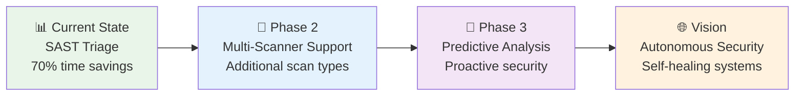

## Getting Started

### Quick Start Options

**Option 1: Demonstration**
- Schedule a demo with sample scan data
- See AI analysis in action
- Review accuracy and time savings

**Option 2: Pilot Project**
- Choose one application for testing
- Run parallel analysis (AI + manual) for comparison
- Measure ROI and team satisfaction

**Option 3: Full Implementation**
- Complete deployment planning
- Team training and change management
- Integration with existing security processes

### Success Criteria

✅ **Immediate**: 50% reduction in manual triage time
✅ **30 Days**: 70% time savings with maintained accuracy
✅ **90 Days**: Full team adoption and workflow integration
✅ **6 Months**: Measurable improvement in threat response time

---

*This AI-powered security triage solution represents the future of efficient, accurate, and scalable application security management.*