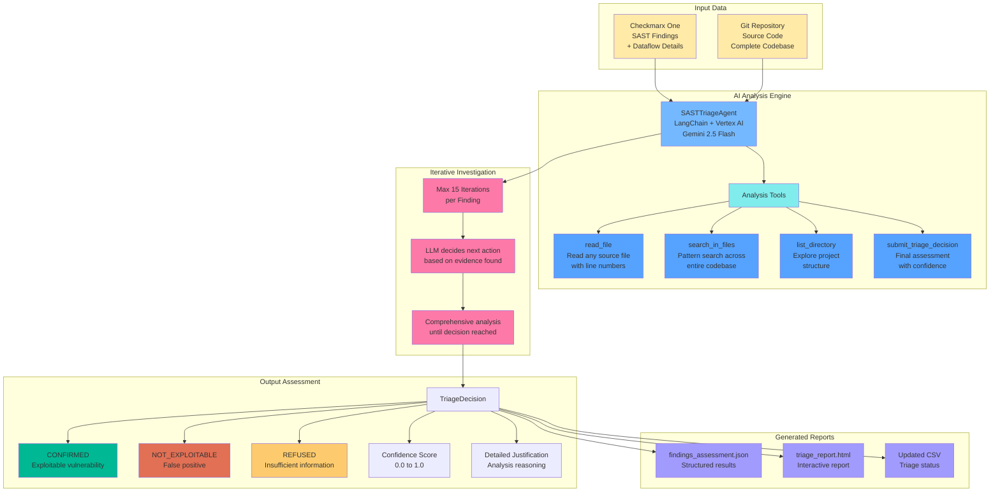

# SAST Triage Agent - Functional Overview

## Problem Statement

Security scanners like Checkmarx generate hundreds of potential vulnerabilities per application scan. Security teams spend 70-80% of their time manually reviewing these findings to determine which ones are actually exploitable and require immediate action.

## Solution Architecture

## How It Works

1. **Data Collection**: Fetches findings from Checkmarx One API and clones the target repository
2. **Finding Analysis**: For each untriaged finding, the AI agent:
   - Loads complete finding details including dataflow
   - Uses available tools to investigate the codebase
   - Performs up to 15 iterations of analysis
   - Makes evidence-based triage decision
3. **Tool Capabilities**: The AI can read any file, search patterns across the codebase, explore directories, and submit final decisions
4. **Output Generation**: Creates structured assessments and interactive HTML reports
5. **Incremental Processing**: Saves results immediately and can resume from interruptions

## Business Impact

- **Time Reduction**: 70-80% reduction in manual triage effort
- **Consistency**: Same analysis standards applied to every finding
- **Scalability**: Handles 100+ findings per scan automatically
- **Audit Trail**: Complete documentation of analysis reasoning

## Key Features

- **Security-First Design**: Path traversal protection, input validation
- **Enterprise Integration**: Works with existing Checkmarx workflows
- **Flexible Configuration**: Supports different severities, branches, single findings
- **Progressive Reporting**: Updates HTML report after each finding analysis