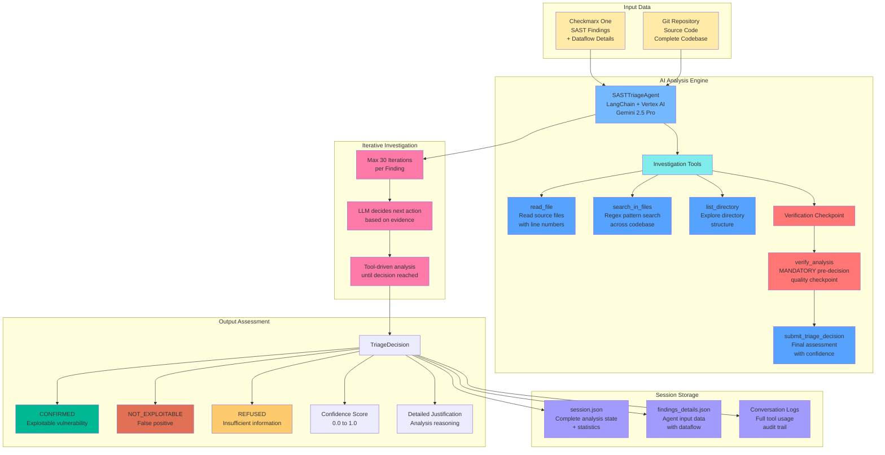

# SAST Triage Agent - Functional Overview

## Problem Statement

Security scanners like Checkmarx generate hundreds of potential vulnerabilities per application scan. Security teams spend 70-80% of their time manually reviewing these findings to determine which ones are actually exploitable and require immediate action.

## Solution Architecture

## How It Works

1. **Session Initialization**: Creates isolated session directory with unique ID, fetches findings from Checkmarx One API, and clones target repository
2. **Finding Analysis**: For each untriaged finding, the AI agent:
   - Loads complete finding details including full dataflow from `findings_details.json`
   - Investigates source code using available tools (read files, search patterns, explore directories)
   - Performs up to 30 iterations of autonomous analysis
   - **Mandatory verification checkpoint** via `verify_analysis` tool before final decision
   - Submits final triage decision with confidence score and justification
3. **Tool Workflow**: Agent follows strict protocol:
   - Investigation tools: `read_file`, `search_in_files`, `list_directory`
   - Quality checkpoint: `verify_analysis` (mandatory - validates evidence and identifies gaps)
   - Final decision: `submit_triage_decision` (only after verification)
4. **Session Persistence**: All analysis results stored in session-specific `session.json` with real-time statistics tracking
5. **Audit Trail**: Complete conversation logs capture every tool invocation and LLM reasoning for full traceability

## Business Impact

- **Time Reduction**: 70-80% reduction in manual triage effort
- **Consistency**: Same analysis standards applied to every finding
- **Scalability**: Handles 100+ findings per scan automatically
- **Audit Trail**: Complete documentation of analysis reasoning

## Key Features

- **Session Isolation**: Each analysis run in dedicated session directory with unique ID
- **Security-First Design**: Path traversal protection, input validation, file locking for concurrent access
- **Quality Assurance**: Mandatory verification checkpoint prevents premature decisions
- **Enterprise Integration**: Works with existing Checkmarx workflows via REST API
- **Flexible Configuration**: Supports severity filtering, branch selection, individual finding analysis
- **Real-Time Tracking**: Session statistics updated incrementally with analysis progress
- **Complete Audit Trail**: Full conversation logs with tool usage for compliance and debugging