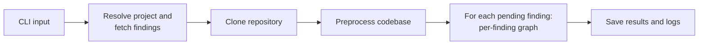

# Architecture

## Overview

The SAST Triage Agent automates the per-finding triage of Checkmarx One SAST results. It fetches findings from the Checkmarx API, clones the associated repository, preprocesses the codebase to remove sensitive data and then runs each finding through a per-finding LangGraph subgraph that produces a structured triage decision.

The subgraph separates four roles into distinct nodes:

- **Research** reads the codebase with file and search tools and accumulates evidence.
- **Analyst** classifies the finding from the accumulated evidence and a CWE-specific checklist.
- **Critic** reviews the analyst's verdict adversarially and decides whether to approve it, demand more research or demand a reanalysis.
- **Aggregate** runs self-consistency voting over several analyst samples and produces the final advisory decision.

This split exists for three reasons:

1. Tool-using and classification are different jobs. Conflating them produces analyses that drift between investigation and decision.
2. A separate adversarial critic at a higher temperature defeats the sycophancy that same-model self-checks exhibit.
3. Calibrated confidence comes from agreement between independently sampled analysts, not from any one model's self-report.

The result is a structured `TriageDecision` per finding: an `is_vulnerable` classification plus a calibrated `confidence`, from which an advisory `suggested_state` is derived deterministically. The tool only reads from Checkmarx One; verdicts are written to a local JSON file and are never written back to Checkmarx.

## System map

| Component | Location | Responsibility |
|-----------|----------|----------------|
| CLI | `run_triage.py` | Entry point, argument parsing, outer-pipeline orchestration |
| Agent | `sast_triage/agent.py` | Builds the per-finding subgraph and the Vertex AI client; iterates findings; persists results |
| Graph | `sast_triage/graph/` | Per-finding LangGraph state machine: research, analyst, critic and aggregate nodes plus pure routing |
| Aggregator | `sast_triage/aggregator.py` | Self-consistency vote and confidence calibration over analyst samples |
| Checklists | `sast_triage/checklists/` | CWE-keyed evidence checklists in YAML, selected per finding |
| Tools | `sast_triage/agent_tools.py` | Investigation tools used by the research node (`read_file`, `search_in_files`, `list_directory`) and findings IO |
| Prompts | `sast_triage/prompts.py` | System prompt templates for the research, analyst and critic roles |
| Models | `sast_triage/agent_models.py` | Pydantic models for findings, verdicts, critiques and the final triage decision |
| Preprocessing | `sast_triage/preprocessing/` | Obfuscation and secret masking |
| Interactive | `sast_triage/interactive.py` | Guided prompt collection for interactive mode |
| Logging | `sast_triage/agent_logging.py` | Session logging with token tracking |
| Checkmarx | `utils/checkmarx_helpers.py` | API client for fetching findings |
| Git | `utils/git_helpers.py` | Repository cloning |
| Findings | `utils/findings_helpers.py` | CSV/JSON persistence of findings data |
| Directories | `utils/directory_helpers.py` | Temp and output directory management |

## Per-Finding Analysis Graph

The graph is compiled once at startup by `build_per_finding_graph` in `sast_triage/graph/build.py` and invoked per finding with `per_finding_graph.ainvoke(state)`.

### Topology


The entry point is the research node, the exit is always the aggregate node and END follows immediately after aggregate writes a verdict.

### State

A single `TriageState` (`sast_triage/graph/state.py`) is threaded through every node. Each node returns a partial update; LangGraph merges it into the next state. The state is created once per finding in `SASTTriageAgent.analyze_single_finding` from a validated `CheckmarxFinding` and the selected checklist.

| Field | Type | Written by | Read by |
|-------|------|------------|---------|
| `finding` | `CheckmarxFinding` | agent (at construction) | research, analyst, critic |
| `checklist` | `ChecklistDocument` | agent (at construction) | research, analyst, critic |
| `evidence` | `EvidenceBundle` | research | research, analyst, critic |
| `research_iterations` | `int` | research (`+1` per visit) | routing (breaker), aggregate |
| `failed_tool_calls` | `list[ToolCallRecord]` | research | research (next visit's prompt) |
| `samples` | `list[AnalystVerdict]` | analyst (append or replace) | critic, aggregate, routing |
| `current_sample_idx` | `int` | analyst | diagnostic |
| `last_critique` | `CritiqueResult` | critic | analyst, routing, aggregate |
| `reanalysis_count` | `int` | analyst (`+1` on `REANALYZE`) | routing (breaker) |
| `stop_reason` | `StopReason` | aggregate | diagnostic, logged |
| `verdict` | `TriageDecision` | aggregate | agent (returned) |

### Research node

**Purpose:** assemble enough code into the CODE BANK that the analyst can classify the finding against every checklist item.

**LLM client.** The research model has `read_file`, `search_in_files` and `list_directory` bound as tools. It has no other tools; verdict and review are produced by other nodes via structured output, not by tool calls.

**Inner loop.** The research node runs an inner tool-call loop, capped by `MAX_TOOL_CALLS_PER_RESEARCH` turns per node visit. Each turn:

1. Rebuilds the message list from state (see "Stateless rebuild" below).
2. Calls the LLM asynchronously.
3. If the response carries no tool calls, the node returns and the analyst gets to run next.
4. If it carries tool calls, each call is dispatched; the result is folded into either `evidence` (success) or `failed_tool_calls` (error). The model's response and the tool messages form `last_round`, which feeds the next iteration.

**Stateless rebuild.** Each turn is rebuilt fresh from state rather than appended to a growing chat transcript:

```
turn N message list = [
    SystemMessage(research-system-prompt + FINDING + checklist + DO NOT RETRY block),
    HumanMessage(CODE BANK rendered from evidence),
    *last_round_from_turn_N_minus_1   # one AIMessage with tool_calls plus the matching ToolMessages
]
```

Two consequences:

- Per-turn input does not grow with the iteration count. Long investigations stay bounded; the model is not at risk of context rot from a multi-turn replay.
- Earlier tool results never disappear: they are folded into the CODE BANK on the way through, so the analyst still sees everything that has been gathered.

**Failure feedback.** Failed tool calls are kept in `state.failed_tool_calls` and rendered into the next system prompt under a `## DO NOT RETRY` block listing the tool name, the arguments and the error. The prompt instructs the model not to repeat them verbatim.

**State writes per visit.**

| Field | Update |
|-------|--------|
| `evidence` | `add()` per successful tool result |
| `failed_tool_calls` | append per errored tool call |
| `research_iterations` | `+= 1` |

The CODE BANK that the model sees on each turn is rendered by `format_code_bank` from `state.evidence`, grouped per item with a `relevance` annotation.

### Analyst node

**Purpose:** decide whether the finding is exploitable, given the CODE BANK and the CWE-specific checklist.

**LLM client.** Structured-output Gemini via `ChatVertexAI.with_structured_output(AnalystVerdict)`. The analyst has no tools; it reasons from the evidence on hand and emits a typed object.

**Inputs.** The system prompt is `ANALYST_SYSTEM_PROMPT` followed by the FINDING (as JSON) and the rendered CWE checklist. The CODE BANK is sent as a `HumanMessage`. When the previous critic round demanded a reanalysis or more research, a refinement `HumanMessage` is appended carrying the critic's `reanalysis_feedback` and any newly required information.

**Five-step analysis protocol** (enforced by the system prompt):

1. **Source:** name the source line and say whether it is attacker-controlled and why.
2. **Sink:** name the sink line and confirm it matches the vulnerability class the finding claims, or one in the same family.
3. **Path:** list the lines between source and sink, marking each `PASSTHROUGH`, `TRANSFORM` or `GUARD`.
4. **Guards:** classify every guard as `EFFECTIVE` or `INEFFECTIVE` for this specific vulnerability type, using the checklist's effective/ineffective lists.
5. **Verdict:** `is_vulnerable=true` if reachable, `is_vulnerable=false` if provably blocked, `is_vulnerable=null` if the evidence is insufficient. When torn between exploitable and not, the analyst chooses exploitable: missing a real vulnerability is worse than a false alarm.

**Output (`AnalystVerdict`).**

| Field | Type | Meaning |
|-------|------|---------|
| `is_vulnerable` | `bool` or `null` | True (exploitable), False (not exploitable), null (undecided) |
| `confidence` | `float` in 0.0-1.0 | Self-reported confidence, before calibration |
| `reasoning` | `str` | The analyst's justification |
| `citation_lines` | `list[str]` | `file:line` references behind each claim |
| `evidence_refs` | `list[str]` | Files or evidence items relied upon |
| `sample_temperature` | `float` | Temperature that produced this sample (set by the node, not the model) |

The self-reported `confidence` is recorded but is not the number that ends up in the final `TriageDecision`. Calibration is done by the aggregator.

**Self-consistency.** The analyst runs several times per finding. The temperatures come from `ANALYST_TEMPERATURES = [0.1, 0.3, 0.5]` (the last value is reused if more samples than entries are taken):

- A **fresh sample** appends a new entry to `state.samples`. The temperature is the next slot's value.
- A **refinement** (the previous critic returned `REANALYZE` or `NEEDS_MORE_RESEARCH`) replaces the last entry in `state.samples` rather than appending. The temperature stays at the current slot. `reanalysis_count` increments only on `REANALYZE`; a `NEEDS_MORE_RESEARCH` round does not count against the reanalysis budget because the research budget already governs it.

**Sample target.** How many samples are required before the aggregate node fires is decided per finding by `target_samples_for(state)`:

- `INITIAL_SAMPLES = 2` is the floor.
- If the first two samples already have a strict majority on `is_vulnerable`, the target stays at the current count.
- Otherwise the target rises by one at a time, capped by `DEFAULT_SAMPLES = 3`. This is the adaptive tiebreak path.

### Critic node

**Purpose:** find the weakest point in the analyst's latest verdict against the evidence. The critic does not produce its own classification.

**LLM client.** A separate `ChatVertexAI.with_structured_output(CritiqueResult)` at `CRITIC_TEMPERATURE = 0.6`, higher than the analyst's slot temperature so the critic is less likely to mirror the analyst's reasoning.

**Inputs.** The critic's system prompt is the adversarial-review prompt plus the rendered checklist. The CODE BANK is appended as a `HumanMessage`. The analyst's last verdict (rendered as the `is_vulnerable`, `confidence`, `reasoning` and `citation_lines`) is appended as another `HumanMessage` so it lands in the request `contents` rather than only in `system_instruction`.

**Output (`CritiqueResult`).**

| Field | Type | Meaning |
|-------|------|---------|
| `decision` | `CritiqueDecision` enum | `APPROVED`, `NEEDS_MORE_RESEARCH` or `REANALYZE` |
| `rationale` | `str` | One-paragraph explanation |
| `weakest_point` | `str` (required) | The single most fragile part of the verdict; required even on `APPROVED` |
| `gaps` | `list[str]` | Free-form list of weak spots |
| `required_information` | `list[str]` | Used when `NEEDS_MORE_RESEARCH`: what the next research round must collect |
| `reanalysis_feedback` | `str` | Used when `REANALYZE`: the specific correction the analyst must apply |
| `citation_lines` | `list[str]` | `file:line` references for the critique |

**Decision semantics.**

| Decision | Triggered when | Next node |
|----------|----------------|-----------|
| `APPROVED` | The verdict is defended by specific evidence and no alternative exploitation path is unaddressed | analyst (more samples needed) or aggregate (target reached) |
| `NEEDS_MORE_RESEARCH` | The verdict cannot be defended with evidence on hand; `required_information` is populated | research |
| `REANALYZE` | Evidence is sufficient but the analyst's reasoning is flawed; `reanalysis_feedback` is populated | analyst (replaces the last sample) |

`weakest_point` is mandatory under every decision so an `APPROVED` cannot devolve into "looks fine to me". If the critic cannot cite specific code to defend the verdict against alternative paths, the prompt requires it to choose `NEEDS_MORE_RESEARCH` or `REANALYZE` instead.

### Aggregate node

**Purpose:** turn the analyst samples into one `TriageDecision`. Pure node, no LLM.

**Inputs.** `state.samples` and `state.stop_reason` (computed inline from `compute_stop_reason(state)`).

**Vote.** The plurality on `is_vulnerable` across samples is the classification, **only if** a strict majority exists (top count is greater than `N/2`). A split (no strict majority) routes the finding to `REFUSED` with confidence 0.0 rather than treating "two against one" as a confident dismissal.

**Confidence calibration.** When the vote is clear:

```
confidence = CONFIDENCE_AGREEMENT_WEIGHT * agreement_rate
           + (1 - CONFIDENCE_AGREEMENT_WEIGHT) * evidence_strength
```

with `CONFIDENCE_AGREEMENT_WEIGHT = 0.7`. The `agreement_rate` is the fraction of samples that voted the majority way. `evidence_strength` is a 0.0-1.0 heuristic that combines the number of distinct files cited across samples and the average citation count per sample, each saturating at `_EVIDENCE_SATURATION = 5`. Both the weight and the saturation are placeholders to be calibrated against a gold-set; today they bias toward sample agreement.

**Edge cases.**

| Sample set | Result |
|------------|--------|
| Empty | `REFUSED`, confidence 0.0, justification notes no samples were produced |
| Split (no strict majority) | `REFUSED`, confidence 0.0, classification null |
| Clear majority | Classification is the plurality value, confidence is the calibrated number |

**State writes.** `verdict` (the `TriageDecision`) and `stop_reason`.

The `suggested_state` on the returned `TriageDecision` is derived from the classification and confidence by `derive_state` (`sast_triage/agent_models.py`); see "Output model" below.

### Routing rules

Routing is implemented by three pure functions in `sast_triage/graph/routing.py`. Pure on purpose: a route function never mutates state. Counter increments and `verdict`/`stop_reason` writes are done by the nodes themselves so the route chosen and the outcome recorded stay consistent.

| From | To | Condition |
|------|----|-----------|
| research | analyst | unconditional |
| analyst | critic | `samples` non-empty (the analyst committed to a verdict on this visit) |
| analyst | research | `samples` empty (the analyst could not commit; more evidence is needed) |
| critic | aggregate | `research_iterations >= MAX_RESEARCH_ITERATIONS` |
| critic | aggregate | `reanalysis_count >= MAX_REANALYSIS_LOOPS` |
| critic | aggregate | `last_critique is None` (defensive; should not happen in normal runs) |
| critic | analyst | `APPROVED` and `len(samples) < target_samples_for(state)` |
| critic | aggregate | `APPROVED` and `len(samples) >= target_samples_for(state)` |
| critic | research | `NEEDS_MORE_RESEARCH` |
| critic | analyst | `REANALYZE` |
| aggregate | END | `verdict is not None` (always; aggregate writes the verdict before returning) |

Breaker conditions are checked before critique decisions so a runaway loop always terminates at the aggregator with a stop reason recorded.

### Circuit breakers and stop reasons

Bounds that keep the subgraph from running away:

| Constant | Default | Guards against |
|----------|---------|----------------|
| `MAX_RESEARCH_ITERATIONS` | 5 | Runaway research loops |
| `MAX_REANALYSIS_LOOPS` | 2 | Critic ping-ponging on the same verdict |
| `MAX_TOOL_CALLS_PER_RESEARCH` | 10 | Tool churn within a single research-node visit |
| `GRAPH_RECURSION_LIMIT` | 50 | LangGraph node-visit safety net |

Whichever fires first routes to the aggregator with a `stop_reason` taken from this set:

| Stop reason | Meaning |
|-------------|---------|
| `approved` | The critic last returned `APPROVED` and the sample target was reached |
| `max_research` | `MAX_RESEARCH_ITERATIONS` hit |
| `max_reanalysis` | `MAX_REANALYSIS_LOOPS` hit |
| `no_progress` | Reserved literal in `StopReason`; not currently emitted by `compute_stop_reason` |

The justification on the final `TriageDecision` mentions an early stop when it was reached because of a breaker.

### Investigation tools

The research node has these tools and only these tools. The analyst and critic use structured output rather than tools.

| Tool | Signature | Purpose |
|------|-----------|---------|
| `read_file` | `(file_path)` | Read a file from the cloned codebase; path-traversal protected |
| `search_in_files` | `(pattern, file_extensions="*")` | Regex search across codebase files; capped by `MAX_SEARCH_RESULTS` |
| `list_directory` | `(directory_path)` | List directory contents within the codebase |

The codebase root used by these tools is `temp/codebase/` (the cloned, preprocessed repository).

## CWE checklists

Each finding's analyst and critic prompts are augmented with a CWE-specific evidence checklist. A checklist supplies the required evidence, the controls that genuinely neutralize this vulnerability class, those that look like controls but do not, investigation guidance and common false-positive patterns.

Selection runs once per finding by `sast_triage.checklists.select_checklist(query_name, cwe)`:

1. Exact, case-insensitive match on Checkmarx `queryName`.
2. Normalized `CWE-<n>` match.
3. `generic.yaml` as the final fallback.

A mapped-but-malformed checklist falls back to the default with a warning; the default itself failing is fatal so a misconfiguration is caught at startup rather than producing silently weaker prompts.

The schema, the shipped checklists and the prompt rendering are documented separately in [checklists.md](checklists.md).

## Output model

Each finding's output separates two concerns:

- **Classification** (`is_vulnerable: true | false | null`, plus a `confidence` in 0.0-1.0): what the agent believes about exploitability.
- **Disposition** (`suggested_state`): what to do about it, derived deterministically from the classification and confidence by `derive_state` in `sast_triage/agent_models.py`.

The derivation, briefly: a positive (`is_vulnerable=true`) is always `CONFIRMED` regardless of confidence; a negative at or above `CONFIDENCE_THRESHOLD` is `NOT_EXPLOITABLE`; below it, `PROPOSED_NOT_EXPLOITABLE`; an undecided classification (`null`) is `REFUSED`. The full table and per-state rationale lives in [usage-guide.md](usage-guide.md#suggested-state).

Keeping classification and disposition separate means tuning `CONFIDENCE_THRESHOLD` shifts findings between `NOT_EXPLOITABLE` and `PROPOSED_NOT_EXPLOITABLE` without changing the classification metrics the benchmark gates on.

**Read-only constraint:** the tool only reads from Checkmarx One. Every `suggested_state` is advisory and is stored only in the local output file. No triage state is ever written back to Checkmarx.

## Outer pipeline

The outer pipeline is plain Python around the per-finding graph. Interactive mode adds two confirmation prompts but the data flow is the same.



Step-by-step:

1. **CLI input:** the user invokes `run` (non-interactive) or `interactive`. Interactive mode collects all configuration via guided prompts and shows a confirmation before continuing.
2. **Project resolution:** the Checkmarx API client authenticates, looks up the project by name and retrieves the project ID and repository URL.
3. **Findings fetch:** findings are retrieved from the Checkmarx `/api/results` endpoint, filtered by severity. A client-side state filter is applied afterward.
4. **Repository clone:** the repository is shallow-cloned (`--depth 1`) into a temporary directory.
5. **Preprocessing:** obfuscation removes infrastructure patterns (IPs, MACs, FQDNs) and secret masking replaces secrets identified by a Gitleaks CSV report. In interactive mode a preprocessing summary is shown and the user can cancel.
6. **Analysis:** each pending finding runs through the per-finding analysis graph described above.
7. **Output:** results are saved incrementally to a timestamped JSON file with metadata.

## Preprocessing

The preprocessing pipeline runs after repository cloning and before LLM analysis. Obfuscation runs first and replaces infrastructure patterns with typed placeholders; secret masking then replaces the secrets identified by a Gitleaks CSV report. Both stages produce structured reports that are recorded in the session log. See [preprocessing.md](preprocessing.md) for the full pipeline.

## LLM backend

The agent uses Google Gemini on Vertex AI through `ChatVertexAI` from `langchain-google-vertexai`. The transport is gRPC, which respects `GRPC_DEFAULT_SSL_ROOTS_FILE_PATH` and so works on corporate networks that re-sign TLS with a private CA.

Project and location are resolved once at startup by `config.resolve_vertex_config`:

- `GOOGLE_CLOUD_PROJECT` (required).
- `GOOGLE_CLOUD_LOCATION` (defaults to `europe-west4`).

Auth is via Application Default Credentials (`gcloud auth application-default login`). The model is selected by the `--model` CLI flag or the interactive prompt; the default is `gemini-2.5-pro`.

## Session logging

Every triage session produces a timestamped JSON log file in the `logs/` directory containing:

- **Session metadata:** model, temperature, project details, branch and repository URL.
- **Preprocessing reports:** obfuscation and masking summaries.
- **Per-finding inputs:** the finding details, the selected checklist id and the final decision.
- **Session summary:** counts for `confirmed`, `not_exploitable`, `proposed_not_exploitable` and `refused`, plus `refusal_rate` and aggregate token usage.

The system prompt is recorded once at the session level and referenced by hash from each per-finding entry so it is not duplicated N times in long runs. The `--compact-logs` flag further strips bulk arrays (file contents, search hits, directory listings) from logged tool results for development analysis.

## Output structure

```
<output-dir>/
    findings_assessment_<project>_<timestamp>.json   # Triage decisions with metadata
```

The assessment file contains a metadata wrapper (project context and summary statistics) plus the full list of per-finding results. Results are saved incrementally after each finding is processed. See [usage-guide.md](usage-guide.md#output) for the result schema.

The temporary directory (`temp/`) holds intermediate data during execution:

```
temp/
    codebase/       # Cloned and preprocessed repository
    findings/
        triage_list.csv           # Finding IDs with severity, state, triage status
        findings_details.json     # Detailed finding data with dataflow
```
