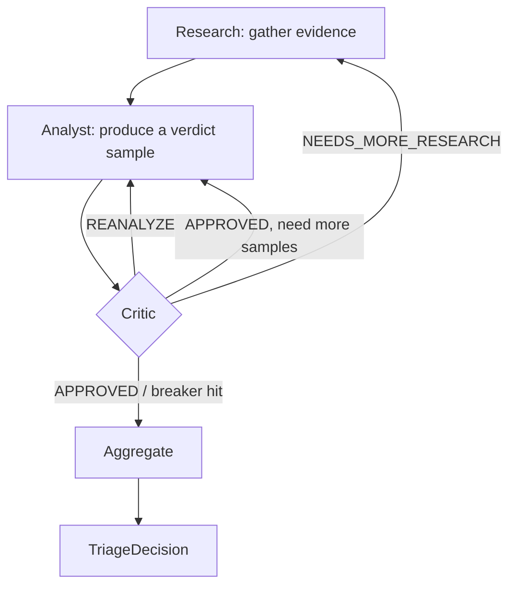

# Architecture

## Overview

The SAST Triage Agent automates the triage of Checkmarx One SAST findings using LLM-powered analysis. It fetches findings from the Checkmarx API, clones the associated repository, preprocesses the codebase to remove sensitive data and then runs each finding through a per-finding LangGraph subgraph (research, analyst, critic and aggregate nodes) to produce a structured triage decision.

The system is built around a CLI entry point (`run_triage.py`) that orchestrates several components:

| Component | Location | Responsibility |
|-----------|----------|---------------|
| CLI | `run_triage.py` | Entry point, argument parsing, orchestration |
| Agent | `sast_triage/agent.py` | Builds the per-finding subgraph and the LLM clients; iterates findings; persists results |
| Graph | `sast_triage/graph/` | Per-finding LangGraph state machine: research, analyst, critic and aggregate nodes plus pure routing |
| Aggregator | `sast_triage/aggregator.py` | Self-consistency vote and confidence calibration over analyst samples |
| Checklists | `sast_triage/checklists/` | CWE-keyed evidence checklists in YAML, selected per finding |
| Tools | `sast_triage/agent_tools.py` | Investigation tools used by the research node (`read_file`, `search_in_files`, `list_directory`) and findings IO |
| Prompts | `sast_triage/prompts.py` | System prompt templates for the research, analyst and critic roles |
| Models | `sast_triage/agent_models.py` | Pydantic models for findings, verdicts, critiques and the final triage decision |
| Preprocessing | `sast_triage/preprocessing/` | Obfuscation and secret masking |
| Interactive | `sast_triage/interactive.py` | Guided prompt collection for interactive mode |
| Logging | `sast_triage/agent_logging.py` | Session logging with token tracking |
| Checkmarx | `utils/checkmarx_helpers.py` | API client for fetching findings |
| Git | `utils/git_helpers.py` | Repository cloning |
| Findings | `utils/findings_helpers.py` | CSV/JSON persistence of findings data |
| Directories | `utils/directory_helpers.py` | Temp and output directory management |

## Processing Flow


### Step-by-step

1. **CLI Input:** the user invokes either `run` (non-interactive) or `interactive` mode via Click sub-commands.
2. **Project Resolution:** the Checkmarx API client authenticates, looks up the project by name and retrieves the project ID and repository URL.
3. **Findings Fetch:** findings are retrieved from the Checkmarx `/api/results` endpoint, filtered by severity. A client-side state filter is applied afterward.
4. **Repository Clone:** the repository is shallow-cloned (`--depth 1`) into a temporary directory.
5. **Preprocessing:** the cloned codebase is processed in two stages: obfuscation removes infrastructure patterns (IPs, MACs, FQDNs) and secret masking replaces secrets identified by a Gitleaks CSV report.
6. **Analysis:** each finding is processed through the per-finding analysis graph (see below).
7. **Output:** results are saved incrementally to a timestamped JSON file with metadata.

## Per-Finding Analysis Graph

Each finding runs through a LangGraph state machine (`sast_triage/graph/`). The outer pipeline stays plain Python; the per-finding control flow is the graph.



The roles are separated across nodes:

1. **Research** gathers evidence. A tool-using LLM reads the codebase with `read_file`, `search_in_files` and `list_directory`, accumulating snippets into an `EvidenceBundle` (the CODE BANK). Each turn is rebuilt statelessly from the graph state (system prompt + code bank + only the last tool round), so the per-turn input stays bounded on long investigations. Failed tool calls are recorded and fed back so they are not retried.
2. **Analyst** decides. With no tools, it reasons over the CODE BANK and the CWE checklist and commits to a structured `AnalystVerdict` (`is_vulnerable`, confidence, reasoning, citations). It enforces the five-step protocol (identify source, identify sink, enumerate the path, classify every guard, verdict) with a `file:line` citation per claim. Self-consistency runs it several times at increasing temperature.
3. **Critic** reviews. A separate adversarial LLM call at a higher temperature critiques the latest verdict against the evidence and returns a structured `CritiqueResult`: `APPROVED`, `NEEDS_MORE_RESEARCH` (loop back to research) or `REANALYZE` (loop back to the analyst with feedback). This replaces a same-model self-check.
4. **Aggregate** collapses the samples by self-consistency: the plurality verdict is the classification and the agreement rate (blended with an evidence-strength term) is the calibrated confidence. A split routes to `REFUSED`. The advisory `suggested_state` is derived from the classification and confidence (see Output Model below).

Circuit breakers bound the loops (research iterations, reanalysis loops, tool calls per research turn); hitting one routes to the aggregator with a recorded stop reason. A CWE-specific evidence checklist is selected from the finding's `queryName` and `cweID` (see CWE Checklists below) and threaded into the research, analyst and critic prompts.

### Investigation Tools

The research node has these tools; the analyst and critic use structured output rather than tools.

| Tool | Purpose |
|------|---------|
| `read_file` | Read a file from the cloned codebase (path-traversal protected) |
| `search_in_files` | Regex search across codebase files with extension filtering |
| `list_directory` | List directory contents within the codebase |

### CWE Checklists

Each finding's analyst prompt is augmented with a CWE-specific evidence checklist. Checklists live in `sast_triage/checklists/` as YAML files validated against the `ChecklistDocument` model. `_mapping.yaml` routes a finding to a checklist: first by an exact, case-insensitive `queryName` match, then by the normalized CWE (`CWE-<n>`), then to `generic.yaml` as the final fallback. A checklist supplies the required evidence, the controls that do and do not neutralize that vulnerability class, investigation guidance and common false-positive patterns. Selection is fail-safe: an unmatched finding, or a mapped checklist that fails to load, falls back to `generic.yaml`.

## Preprocessing Pipeline

The preprocessing pipeline runs after repository cloning and before LLM analysis. Obfuscation runs first and replaces infrastructure patterns (IPs, MACs, FQDNs) with typed placeholders; secret masking then replaces the secrets identified by a Gitleaks CSV report. Both stages produce structured reports that are recorded in the session log. See [preprocessing.md](preprocessing.md) for the full pipeline.

## Output Model

Each finding's output separates two concerns:

- **Classification** (`is_vulnerable`: `true` | `false` | `null`, plus a `confidence` in 0.0-1.0): what the agent believes about exploitability.
- **Disposition** (`suggested_state`): what to do about it, derived deterministically from the classification and confidence by `derive_state` in `sast_triage/agent_models.py`.

The derivation: a positive (`is_vulnerable=true`) is always `CONFIRMED` regardless of confidence, since missing a real vulnerability is the worst outcome. A negative at or above `CONFIDENCE_THRESHOLD` is `NOT_EXPLOITABLE`; below it, `PROPOSED_NOT_EXPLOITABLE` (flagged for human review). An undecided classification (`null`) is `REFUSED`.

Keeping classification and disposition separate means tuning `CONFIDENCE_THRESHOLD` shifts findings between `NOT_EXPLOITABLE` and `PROPOSED_NOT_EXPLOITABLE` without changing the classification metrics the benchmark gates on.

**Read-only constraint:** the tool only reads from Checkmarx One. Every `suggested_state` is advisory and is stored only in the local output file. No triage state is ever written back to Checkmarx.

## LLM Backend

The agent uses Google Gemini on Vertex AI through the `ChatVertexAI` client from `langchain-google-vertexai`. The transport is gRPC, which respects `GRPC_DEFAULT_SSL_ROOTS_FILE_PATH` and so works on corporate networks that re-sign TLS with a private CA.

Configure via environment:

- `GOOGLE_CLOUD_PROJECT`: GCP project ID (required).
- `GOOGLE_CLOUD_LOCATION`: Vertex AI region (defaults to `europe-west4`).

Auth is via Application Default Credentials (`gcloud auth application-default login`). The model is controlled by the `--model` CLI flag or the interactive prompt. Project and location are resolved once at startup in `config.resolve_vertex_config`.

## Session Logging

Every triage session produces a timestamped JSON log file in the `logs/` directory containing:

- **Session metadata:** model, temperature, project details, branch and repository URL.
- **Preprocessing reports:** obfuscation and masking summaries.
- **Per-finding inputs:** the finding details and selected checklist, plus the final decision.
- **Session summary:** counts for `confirmed`, `not_exploitable`, `proposed_not_exploitable` and `refused`, plus `refusal_rate` and aggregate token usage.

## Output Structure

```
<output-dir>/
    findings_assessment_<project>_<timestamp>.json   # Triage decisions with metadata
```

The assessment file contains a metadata wrapper (project context and summary statistics) plus the full list of per-finding results. Results are saved incrementally after each finding is processed. See [usage-guide.md](usage-guide.md#output) for the result schema and `suggested_state` derivation.

The temporary directory (`temp/`) holds intermediate data during execution:

```
temp/
    codebase/       # Cloned and preprocessed repository
    findings/
        triage_list.csv           # Finding IDs with severity, state, triage status
        findings_details.json     # Detailed finding data with dataflow
```
