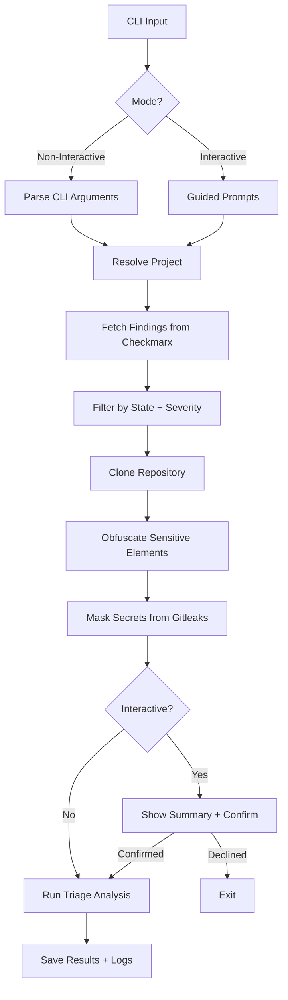
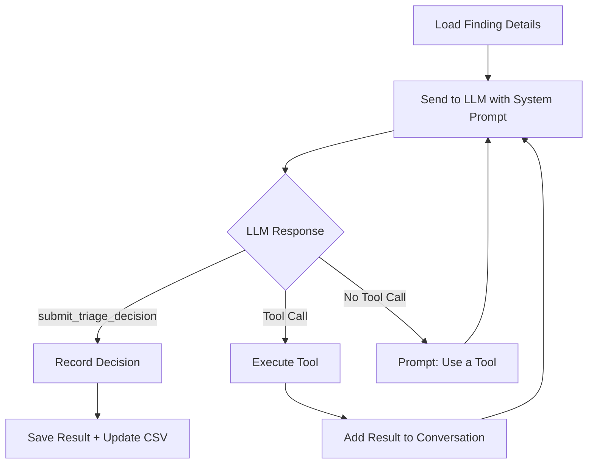
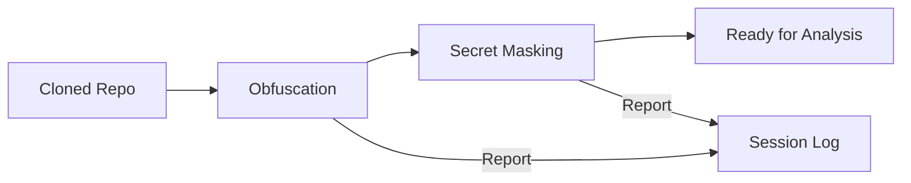

# Architecture

## Overview

The SAST Triage Agent automates the triage of Checkmarx One SAST findings using LLM-powered analysis. It fetches findings from the Checkmarx API, clones the associated repository, preprocesses the codebase to remove sensitive data, and then uses a LangChain agent loop to assess each finding for exploitability.

The system is built around a CLI entry point (`run_triage.py`) that orchestrates several components:

| Component | Location | Responsibility |
|-----------|----------|---------------|
| CLI | `run_triage.py` | Entry point, argument parsing, orchestration |
| Agent | `sast_triage/agent.py` | LLM interaction loop, tool dispatch, decision collection |
| Tools | `sast_triage/agent_tools.py` | File reading, code search, decision submission |
| Prompts | `sast_triage/prompts.py` | System and input prompt templates |
| Models | `sast_triage/agent_models.py` | Pydantic models for triage decisions |
| Preprocessing | `sast_triage/preprocessing/` | Obfuscation and secret masking |
| Interactive | `sast_triage/interactive.py` | Guided prompt collection for interactive mode |
| Logging | `sast_triage/agent_logging.py` | Session logging with token tracking |
| Tracing | `sast_triage/tracing.py` | Optional Phoenix/OpenTelemetry integration |
| Checkmarx | `utils/checkmarx_helpers.py` | API client for fetching findings |
| Git | `utils/git_helpers.py` | Repository cloning |
| Findings | `utils/findings_helpers.py` | CSV/JSON persistence of findings data |
| Directories | `utils/directory_helpers.py` | Temp and output directory management |

## Processing Flow



### Step-by-step

1. **CLI Input** -- The user invokes either `run` (non-interactive) or `interactive` mode via Click sub-commands.
2. **Project Resolution** -- The Checkmarx API client authenticates, looks up the project by name, and retrieves the project ID and repository URL.
3. **Findings Fetch** -- Findings are retrieved from the Checkmarx `/api/results` endpoint, filtered by severity. A client-side state filter is applied afterward.
4. **Repository Clone** -- The repository is shallow-cloned (`--depth 1`) into a temporary directory.
5. **Preprocessing** -- The cloned codebase is processed in two stages: obfuscation removes infrastructure patterns (IPs, MACs, FQDNs), and secret masking replaces secrets identified by a Gitleaks CSV report.
6. **Analysis** -- Each finding is processed through the LLM agent loop (see below).
7. **Output** -- Results are saved incrementally to a timestamped JSON file with metadata.

## Agent Analysis Loop



The agent uses a tool-calling pattern with LangChain:

1. The finding details (dataflow, severity, query name, CWE) are formatted into a human prompt and sent to the LLM alongside a system prompt.
2. The LLM responds with tool calls to investigate the codebase: `read_file`, `search_in_files`, `list_directory`.
3. A `verify_analysis` checkpoint tool ensures the agent reviews its reasoning before submitting.
4. The final `submit_triage_decision` tool records the verdict (CONFIRMED / NOT_EXPLOITABLE) with confidence and justification.
5. If the LLM responds without a tool call, a nudge message is injected to keep the loop progressing.
6. The loop is capped at a configurable maximum number of iterations (default: 30).

### Available Tools

| Tool | Purpose |
|------|---------|
| `read_file` | Read a file from the cloned codebase (path-traversal protected) |
| `search_in_files` | Regex search across codebase files with extension filtering |
| `list_directory` | List directory contents within the codebase |
| `verify_analysis` | Verification checkpoint before final decision |
| `submit_triage_decision` | Submit the final exploitability verdict |

## Preprocessing Pipeline



The preprocessing pipeline runs after repository cloning and before LLM analysis. Both stages produce structured reports that are recorded in the session log. See [preprocessing.md](preprocessing.md) for details.

## LLM Backend

The agent supports multiple LLM backends through LangChain:

- **Gemini models** (default): Accessed via `ChatVertexAI` from `langchain-google-vertexai`
- **Claude models**: Accessed via `ChatAnthropicVertex` when the model name contains "claude"

Model selection is controlled by the `--model` CLI flag or the interactive prompt. Both backends use the same tool-calling interface.

## Session Logging

Every triage session produces a timestamped JSON log file in the `logs/` directory containing:

- **Session metadata**: model, temperature, project details, branch, repository URL
- **Preprocessing reports**: obfuscation and masking summaries
- **Per-finding conversation**: full message history, tool calls and results, token usage
- **Session summary**: totals for confirmed/not_exploitable/refused, aggregate token usage

## Output Structure

```
<output-dir>/
    findings_assessment_<project>_<timestamp>.json   # Triage decisions with metadata
```

The findings assessment file contains a metadata wrapper with project context and summary statistics, plus the full list of per-finding results. Results are saved incrementally after each finding is processed.

The temporary directory (`temp/`) holds intermediate data during execution:

```
temp/
    codebase/       # Cloned and preprocessed repository
    findings/
        triage_list.csv           # Finding IDs with severity, state, triage status
        findings_details.json     # Detailed finding data with dataflow
```
