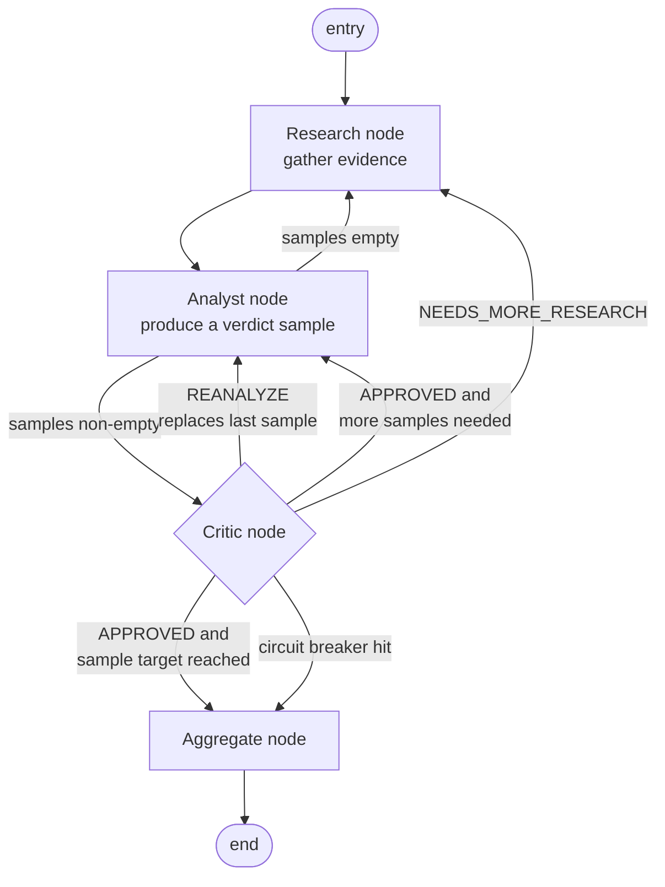
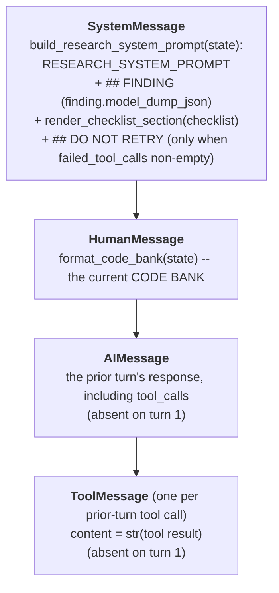
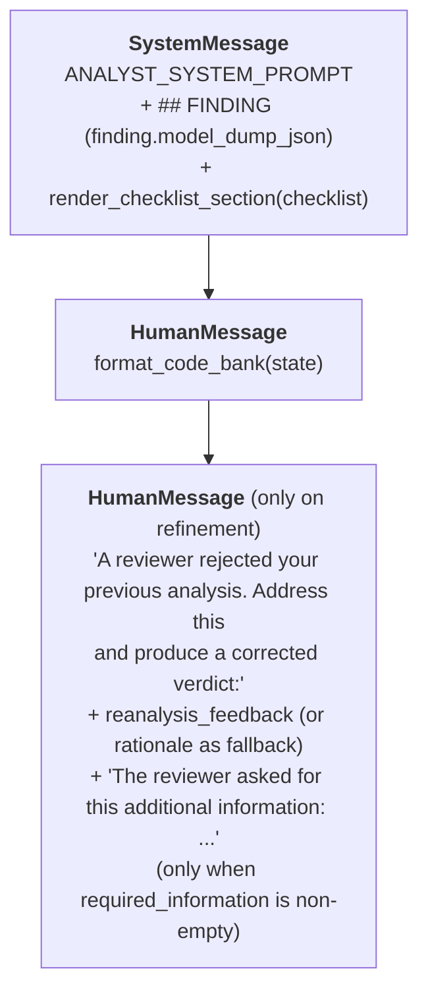
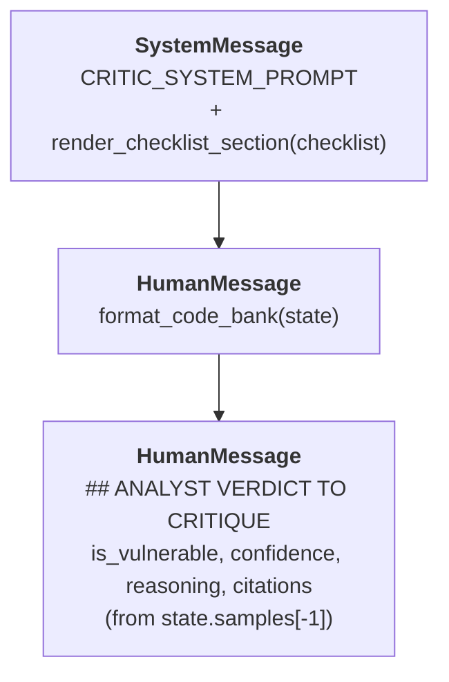

# Architecture

## Overview

The SAST Triage Agent automates the per-finding triage of Checkmarx One SAST results. It fetches findings from the Checkmarx API, clones the associated repository, preprocesses the codebase to remove sensitive data and then runs each finding through a per-finding LangGraph subgraph that produces a structured triage decision.

The subgraph separates four roles into distinct nodes:

- **Research** reads the codebase with file and search tools and accumulates evidence.
- **Analyst** classifies the finding from the accumulated evidence and a CWE-specific checklist.
- **Critic** reviews the analyst's verdict adversarially and decides whether to approve it, demand more research or demand a reanalysis.
- **Aggregate** runs self-consistency voting over several analyst samples and produces the final advisory decision.

This split exists for three reasons:

1. Tool-using and classification are different jobs. Conflating them produces analyses that drift between investigation and decision.
2. A separate adversarial critic at a higher temperature defeats the sycophancy that same-model self-checks exhibit.
3. Calibrated confidence comes from agreement between independently sampled analysts, not from any one model's self-report.

The result is a structured `TriageDecision` per finding: an `is_vulnerable` classification plus a calibrated `confidence`, from which an advisory `suggested_state` is derived deterministically. The tool only reads from Checkmarx One; verdicts are written to a local JSON file and are never written back to Checkmarx.

## System map

| Component | Location | Responsibility |
|-----------|----------|----------------|
| CLI | `run_triage.py` | Entry point, argument parsing, outer-pipeline orchestration |
| Agent | `sast_triage/agent.py` | Builds the per-finding subgraph and the Vertex AI client; iterates findings; persists results |
| Graph | `sast_triage/graph/` | Per-finding LangGraph state machine: research, analyst, critic and aggregate nodes plus pure routing |
| Aggregator | `sast_triage/aggregator.py` | Self-consistency vote and confidence calibration over analyst samples |
| Checklists | `sast_triage/checklists/` | CWE-keyed evidence checklists in YAML, selected per finding |
| Tools | `sast_triage/agent_tools.py` | Investigation tools used by the research node (`read_file`, `search_in_files`, `list_directory`) and findings IO |
| Prompts | `sast_triage/prompts.py` | System prompt templates for the research, analyst and critic roles |
| Models | `sast_triage/agent_models.py` | Pydantic models for findings, verdicts, critiques and the final triage decision |
| Preprocessing | `sast_triage/preprocessing/` | Obfuscation and secret masking |
| Interactive | `sast_triage/interactive.py` | Guided prompt collection for interactive mode |
| Logging | `sast_triage/agent_logging.py` | Session logging with token tracking |
| Checkmarx | `utils/checkmarx_helpers.py` | API client for fetching findings |
| Git | `utils/git_helpers.py` | Repository cloning |
| Findings | `utils/findings_helpers.py` | CSV/JSON persistence of findings data |
| Directories | `utils/directory_helpers.py` | Temp and output directory management |

## Per-Finding Analysis Graph

The graph is compiled once at startup by `build_per_finding_graph` in `sast_triage/graph/build.py` and invoked per finding with `per_finding_graph.ainvoke(state)`.

### Topology



The entry point is the research node, the exit is always the aggregate node and END follows immediately after aggregate writes a verdict.

### State

A single `TriageState` (`sast_triage/graph/state.py`) is threaded through every node. Each node returns a partial update; LangGraph merges it into the next state. The state is created once per finding in `SASTTriageAgent.analyze_single_finding` from a validated `CheckmarxFinding` and the selected checklist.

| Field | Type | Written by | Read by |
|-------|------|------------|---------|
| `finding` | `CheckmarxFinding` | agent (at construction) | research, analyst, critic |
| `checklist` | `ChecklistDocument` | agent (at construction) | research, analyst, critic |
| `evidence` | `EvidenceBundle` | research | research, analyst, critic |
| `research_iterations` | `int` | research (`+1` per visit) | routing (breaker), aggregate |
| `failed_tool_calls` | `list[ToolCallRecord]` | research | research (next visit's prompt) |
| `samples` | `list[AnalystVerdict]` | analyst (append or replace) | critic, aggregate, routing |
| `current_sample_idx` | `int` | analyst | diagnostic |
| `last_critique` | `CritiqueResult` | critic | analyst, routing, aggregate |
| `reanalysis_count` | `int` | analyst (`+1` on `REANALYZE`) | routing (breaker) |
| `stop_reason` | `StopReason` | aggregate | diagnostic, logged |
| `verdict` | `TriageDecision` | aggregate | agent (returned) |

### The CODE BANK

The CODE BANK is the shared working memory of the per-finding subgraph. The research node appends to it; all three LLM-calling nodes (research, analyst and critic) read it as a `HumanMessage`. It lives on `TriageState` as an `EvidenceBundle`:

```python
class EvidenceBundle(BaseModel):
    items: List[CodeEvidence]            # ordered, no deduplication

class CodeEvidence(BaseModel):
    file_path: str                       # see "Label semantics" below
    start_line: Optional[int] = None     # metadata, not rendered into the prompt
    end_line: Optional[int] = None       # metadata, not rendered into the prompt
    content: str                         # the raw text returned by the tool
    relevance: str = ""                  # which tool produced the entry
```

**Label semantics.** The `file_path` doubles as a tag for the kind of evidence the entry holds. The research node's `_evidence_from_result` sets it from the tool that produced the entry:

| Tool | `file_path` value | `relevance` value |
|------|-------------------|--------------------|
| `read_file` | the file path argument | `"read_file"` |
| `search_in_files` | `"search:<pattern>"` | `"search_in_files"` |
| `list_directory` | `"dir:<path>"` | `"list_directory"` |

**Render shape (`format_code_bank`).** Items are concatenated in insertion order. When the bundle is empty the bank is rendered as `"## CODE BANK\nNo evidence gathered yet."` so the prompt always carries at least one non-empty `HumanMessage` (Gemini rejects requests whose `contents` array is empty):

```
## CODE BANK
=== src/main/java/com/example/api/UserController.java (read_file) ===
@GetMapping("/users/{id}")
public User getUser(@PathVariable String id) { ... }

=== search:queryForObject (search_in_files) ===
src/main/java/com/example/repo/UserRepository.java:88: jdbcTemplate.queryForObject(sql, User.class);
```

**No deduplication at the data layer.** Entries are appended; the bundle does not check whether a file is already present. The research system prompt instructs the model not to re-read a file already in the CODE BANK, and failed tool calls are surfaced in a `DO NOT RETRY` block. This is a prompt-level guarantee, not a structural one: the only structural cap is `MAX_TOOL_CALLS_PER_RESEARCH` per research-node visit.

The bank is rendered identically by every node so the analyst and critic see exactly the shape the researcher built. There is no per-node filtering or summarization layer.

### Research node

**Purpose:** assemble enough code into the CODE BANK that the analyst can classify the finding against every checklist item.

**LLM client.** The research model has `read_file`, `search_in_files` and `list_directory` bound as tools. It has no other tools; verdict and review are produced by other nodes via structured output, not by tool calls.

**Inner loop.** The research node runs an inner tool-call loop, capped by `MAX_TOOL_CALLS_PER_RESEARCH` turns per node visit. Each turn:

1. Rebuilds the message list from state (see "Stateless rebuild" below).
2. Calls the LLM asynchronously.
3. If the response carries no tool calls, the node returns and the analyst gets to run next.
4. If it carries tool calls, each call is dispatched; the result is folded into either `evidence` (success) or `failed_tool_calls` (error). The model's response and the tool messages form `last_round`, which feeds the next iteration.

**Stateless rebuild.** Each turn is rebuilt fresh from state rather than appended to a growing chat transcript. The per-turn message stack:



`build_research_messages` returns `[SystemMessage, HumanMessage, *last_round]` where `last_round` is the prior turn's `[AIMessage, ToolMessage, ToolMessage, ...]`. Older turns are never replayed.

Two consequences:

- Per-turn input does not grow with the iteration count. Long investigations stay bounded; the model is not at risk of context rot from a multi-turn replay.
- Earlier tool results never disappear: they are folded into the CODE BANK on the way through, so the analyst still sees everything that has been gathered.

**Failure feedback.** Failed tool calls are kept in `state.failed_tool_calls` and rendered into the next system prompt under a `## DO NOT RETRY` block listing the tool name, the arguments and the error. The prompt instructs the model not to repeat them verbatim.

**State writes per visit.**

| Field | Update |
|-------|--------|
| `evidence` | `add()` per successful tool result |
| `failed_tool_calls` | append per errored tool call |
| `research_iterations` | `+= 1` |
| `research_stall_streak` | `+= 1` when the visit added no new evidence, reset to `0` when it did |

The CODE BANK that the model sees on each turn is rendered by `format_code_bank` from `state.evidence`, grouped per item with a `relevance` annotation.

### Analyst node

**Purpose:** decide whether the finding is exploitable, given the CODE BANK and the CWE-specific checklist.

**LLM client.** Structured-output Gemini via `ChatVertexAI.with_structured_output(AnalystVerdict)`. The analyst has no tools; it reasons from the evidence on hand and emits a typed object.

**Prompt anatomy.** `build_analyst_messages` returns:



The refinement message is appended when the previous `last_critique.decision` is `REANALYZE` or `NEEDS_MORE_RESEARCH` and at least one sample already exists. The checklist is included in the system prompt (not in the human-side context) for symmetry with the research and critic prompts: every node reasons against the same per-CWE evidence requirements and effective/ineffective control lists.

**Five-step analysis protocol** (enforced by the system prompt):

1. **Source:** name the source line and say whether it is attacker-controlled and why.
2. **Sink:** name the sink line and confirm it matches the vulnerability class the finding claims, or one in the same family.
3. **Path:** list the lines between source and sink, marking each `PASSTHROUGH`, `TRANSFORM` or `GUARD`.
4. **Guards:** classify every guard as `EFFECTIVE` or `INEFFECTIVE` for this specific vulnerability type, using the checklist's effective/ineffective lists.
5. **Verdict:** `is_vulnerable=true` if reachable, `is_vulnerable=false` if provably blocked, `is_vulnerable=null` if the evidence is insufficient. When torn between exploitable and not, the analyst chooses exploitable: missing a real vulnerability is worse than a false alarm.

**Output.** Structured output binds the LLM to this Pydantic schema:

```python
class AnalystVerdict(BaseModel):
    is_vulnerable: Optional[bool]            # True (exploitable), False (not), None (undecided)
    confidence: float                        # ge=0.0, le=1.0; self-report, before calibration
    reasoning: str
    citation_lines: List[str] = []           # "file:line" per claim
    evidence_refs: List[str] = []            # files or evidence items relied upon
    sample_temperature: Optional[float] = None  # set by the node, not the model
```

The self-reported `confidence` is recorded but is not the number that ends up in the final `TriageDecision`. Calibration is done by the aggregator.

**Self-consistency.** The analyst runs several times per finding. The temperatures come from `ANALYST_TEMPERATURES = [0.1, 0.3, 0.5]` (the last value is reused if more samples than entries are taken):

- A **fresh sample** appends a new entry to `state.samples`. The temperature is the next slot's value.
- A **refinement** (the previous critic returned `REANALYZE` or `NEEDS_MORE_RESEARCH`) replaces the last entry in `state.samples` rather than appending. The temperature stays at the current slot. `reanalysis_count` increments only on `REANALYZE`; a `NEEDS_MORE_RESEARCH` round does not count against the reanalysis budget because the research budget already governs it.

**Sample target.** How many samples are required before the aggregate node fires is decided per finding by `target_samples_for(state)`:

- `INITIAL_SAMPLES = 2` is the floor.
- If the first two samples already have a strict majority on `is_vulnerable`, the target stays at the current count.
- Otherwise the target rises by one at a time, capped by `DEFAULT_SAMPLES = 3`. This is the adaptive tiebreak path.

### Critic node

**Purpose:** find the weakest point in the analyst's latest verdict against the evidence. The critic does not produce its own classification.

**LLM client.** A separate `ChatVertexAI.with_structured_output(CritiqueResult)` at `CRITIC_TEMPERATURE = 0.6`, higher than the analyst's slot temperature so the critic is less likely to mirror the analyst's reasoning.

**Prompt anatomy.** `build_critic_messages` returns:



The verdict-block content is rendered by `_render_verdict` from the most recent `AnalystVerdict`. Sending it as a `HumanMessage` keeps it in the request `contents` rather than only the `system_instruction`, so the critic always has at least one non-system turn (Gemini constraint).

**Output.** Structured output binds the LLM to this Pydantic schema:

```python
class CritiqueDecision(str, Enum):
    APPROVED = "APPROVED"
    NEEDS_MORE_RESEARCH = "NEEDS_MORE_RESEARCH"
    REANALYZE = "REANALYZE"

class CritiqueResult(BaseModel):
    decision: CritiqueDecision
    rationale: str
    weakest_point: str                # required even on APPROVED
    gaps: List[str] = []
    required_information: List[str] = []   # populated when NEEDS_MORE_RESEARCH
    reanalysis_feedback: str = ""          # populated when REANALYZE
    citation_lines: List[str] = []
```

**Decision semantics.**

| Decision | Triggered when | Next node |
|----------|----------------|-----------|
| `APPROVED` | The verdict is defended by specific evidence and no alternative exploitation path is unaddressed | analyst (more samples needed) or aggregate (target reached) |
| `NEEDS_MORE_RESEARCH` | The verdict cannot be defended with evidence on hand; `required_information` is populated | research |
| `REANALYZE` | Evidence is sufficient but the analyst's reasoning is flawed; `reanalysis_feedback` is populated | analyst (replaces the last sample) |

`weakest_point` is mandatory under every decision so an `APPROVED` cannot devolve into "looks fine to me". If the critic cannot cite specific code to defend the verdict against alternative paths, the prompt requires it to choose `NEEDS_MORE_RESEARCH` or `REANALYZE` instead.

### Aggregate node

**Purpose:** turn the analyst samples into one `TriageDecision`. Pure node, no LLM.

**Inputs.** `state.samples` and `state.stop_reason` (computed inline from `compute_stop_reason(state)`).

**Vote.** The plurality on `is_vulnerable` across samples is the classification, **only if** a strict majority exists (top count is greater than `N/2`). A split (no strict majority) routes the finding to `REFUSED` with confidence 0.0 rather than treating "two against one" as a confident dismissal.

**Confidence calibration.** When the vote is clear:

```
confidence = CONFIDENCE_AGREEMENT_WEIGHT * agreement_rate
           + (1 - CONFIDENCE_AGREEMENT_WEIGHT) * evidence_strength
```

with `CONFIDENCE_AGREEMENT_WEIGHT = 0.7`. The `agreement_rate` is the fraction of samples that voted the majority way. `evidence_strength` is a 0.0-1.0 heuristic that combines the number of distinct files cited across samples and the average citation count per sample, each saturating at `_EVIDENCE_SATURATION = 5`. Both the weight and the saturation are placeholders to be calibrated against a gold-set; today they bias toward sample agreement.

**Uncorroborated samples.** Agreement is credited only with at least `_MIN_CORROBORATING_SAMPLES = 2` samples behind the verdict. A finding that loops through refinement can reach the aggregator with a single sample, whose `agreement_rate` is trivially 1.0: that is one opinion, not a consensus. For a single sample the confidence rests on `evidence_strength` alone (`(1 - CONFIDENCE_AGREEMENT_WEIGHT) * evidence_strength`) and `agreement_rate` is reported as `None`. A single-sample aggregation only happens on a non-`approved` stop (an `APPROVED` verdict always collects a second sample), so this corrects the reported confidence and the diagnostic without changing the disposition the clamp below already produces.

**Non-convergent clamp.** A not-exploitable verdict reached without genuine critic approval (`stop_reason` is anything other than `"approved"`, for example a `max_research` or `max_reanalysis` breaker) has not earned a confident dismissal: it is often a single unvalidated sample whose `agreement_rate` is trivially 1.0. Its confidence is capped at `NON_CONVERGENT_CONFIDENCE_CAP = 0.8`, below `CONFIDENCE_THRESHOLD`, so it routes to `PROPOSED_NOT_EXPLOITABLE` for human review rather than `NOT_EXPLOITABLE`. A positive verdict is untouched (`derive_state` confirms it regardless of confidence), so the clamp never lowers CONFIRMED recall.

**Edge cases.**

| Sample set | Result |
|------------|--------|
| Empty | `REFUSED`, confidence 0.0, justification notes no samples were produced |
| Split (no strict majority) | `REFUSED`, confidence 0.0, classification null |
| Clear majority | Classification is the plurality value, confidence is the calibrated number |
| Clear majority, single sample | Agreement not credited: confidence is `(1 - CONFIDENCE_AGREEMENT_WEIGHT) * evidence_strength`, `agreement_rate` reported as `None` |
| Clear majority, not exploitable, non-convergent stop | Confidence capped below `CONFIDENCE_THRESHOLD`, so the disposition is `PROPOSED_NOT_EXPLOITABLE` (human review) |

**State writes.** `verdict` (the `TriageDecision`) and `stop_reason`.

The `suggested_state` on the returned `TriageDecision` is derived from the classification and confidence by `derive_state` (`sast_triage/agent_models.py`); see "Output model" below.

### Sampling-loop scenarios

How the analyst, critic and routing interact to produce a self-consistent sample set. Three representative patterns:

**A. Clean majority at `INITIAL_SAMPLES`.** The first two samples agree; the run stops at two.

```
research                                                  evidence accumulates
analyst   T=0.1   append   vote=True        samples=[T]
critic    APPROVED                          target=INITIAL_SAMPLES=2
                                            len(samples)=1 < 2 -> analyst
analyst   T=0.3   append   vote=True        samples=[T, T]
critic    APPROVED                          has_majority(T,T) -> target stays 2
                                            len(samples)=2 >= 2 -> aggregate
aggregate                                   agreement_rate=1.0, classification=True
```

**B. Adaptive tiebreak to `DEFAULT_SAMPLES`.** Samples 1 and 2 disagree; a third sample breaks the tie.

```
research
analyst   T=0.1   append   vote=True        samples=[T]
critic    APPROVED                          target=2, len(samples)=1 < 2 -> analyst
analyst   T=0.3   append   vote=False       samples=[T, F]
critic    APPROVED                          no majority -> target rises to 3
                                            len(samples)=2 < 3 -> analyst
analyst   T=0.5   append   vote=True        samples=[T, F, T]
critic    APPROVED                          has_majority(T,F,T) -> target=3
                                            len(samples)=3 >= 3 -> aggregate
aggregate                                   agreement_rate=2/3, classification=True
```

**C. Reanalysis loop.** The critic rejects the analyst's reasoning; the analyst rewrites the slot rather than appending.

```
research
analyst   T=0.1   append   vote=True        samples=[T], reanalysis_count=0
critic    REANALYZE                         reanalysis_count < MAX_REANALYSIS_LOOPS=2 -> analyst
analyst   T=0.1   REPLACE  vote=False       samples=[F], reanalysis_count=1
                                            (slot_index stays 0, so temperature stays 0.1)
critic    APPROVED                          target=2, len(samples)=1 < 2 -> analyst
analyst   T=0.3   append   vote=False       samples=[F, F]
critic    APPROVED                          has_majority(F,F) -> aggregate
aggregate                                   agreement_rate=1.0, classification=False
```

A third consecutive `REANALYZE` would hit `MAX_REANALYSIS_LOOPS`, route to aggregate and record `stop_reason="max_reanalysis"`. A `NEEDS_MORE_RESEARCH` instead would route back to research and replace the in-progress slot the next time the analyst runs; only `REANALYZE` increments `reanalysis_count`.

### Routing rules

Routing is implemented by three pure functions in `sast_triage/graph/routing.py`. Pure on purpose: a route function never mutates state. Counter increments and `verdict`/`stop_reason` writes are done by the nodes themselves so the route chosen and the outcome recorded stay consistent.

| From | To | Condition |
|------|----|-----------|
| research | analyst | unconditional |
| analyst | critic | `samples` non-empty (the analyst committed to a verdict on this visit) |
| analyst | research | `samples` empty (the analyst could not commit; more evidence is needed) |
| critic | aggregate | `research_iterations >= MAX_RESEARCH_ITERATIONS` |
| critic | aggregate | `reanalysis_count >= MAX_REANALYSIS_LOOPS` |
| critic | aggregate | `last_critique is None` (defensive; should not happen in normal runs) |
| critic | analyst | `APPROVED` and `len(samples) < target_samples_for(state)` |
| critic | aggregate | `APPROVED` and `len(samples) >= target_samples_for(state)` |
| critic | research | `NEEDS_MORE_RESEARCH` and `research_stall_streak < MAX_RESEARCH_STALL` |
| critic | aggregate | `NEEDS_MORE_RESEARCH` and `research_stall_streak >= MAX_RESEARCH_STALL` (honest termination, `no_progress`) |
| critic | analyst | `REANALYZE` |
| aggregate | END | `verdict is not None` (always; aggregate writes the verdict before returning) |

Breaker conditions are checked before critique decisions so a runaway loop always terminates at the aggregator with a stop reason recorded.

### Circuit breakers and stop reasons

Bounds that keep the subgraph from running away:

| Constant | Default | Guards against |
|----------|---------|----------------|
| `MAX_RESEARCH_ITERATIONS` | 5 | Runaway research loops |
| `MAX_REANALYSIS_LOOPS` | 2 | Critic ping-ponging on the same verdict |
| `MAX_TOOL_CALLS_PER_RESEARCH` | 10 | Tool churn within a single research-node visit |
| `MAX_RESEARCH_STALL` | 2 | Research looping on evidence it cannot obtain |
| `GRAPH_RECURSION_LIMIT` | 50 | LangGraph node-visit safety net |

Whichever fires first routes to the aggregator with a `stop_reason` taken from this set:

| Stop reason | Meaning |
|-------------|---------|
| `approved` | The critic last returned `APPROVED` and the sample target was reached |
| `max_research` | `MAX_RESEARCH_ITERATIONS` hit |
| `max_reanalysis` | `MAX_REANALYSIS_LOOPS` hit |
| `no_progress` | The critic still wants more research but `research_stall_streak >= MAX_RESEARCH_STALL`: the evidence cannot be obtained in the cloned scope, so the loop terminates honestly instead of burning the research budget. Checked after the two breakers so the recorded reason matches the route taken. |

The justification on the final `TriageDecision` mentions an early stop when it was reached because of a breaker or an evidence stall. A not-exploitable `no_progress` verdict is capped below `CONFIDENCE_THRESHOLD` by the non-convergent clamp (its `stop_reason` is not `"approved"`), so it routes to `PROPOSED_NOT_EXPLOITABLE` for human review rather than `NOT_EXPLOITABLE`.

### Investigation tools

The research node has these tools and only these tools. The analyst and critic use structured output rather than tools.

| Tool | Signature | Purpose |
|------|-----------|---------|
| `read_file` | `(file_path)` | Read a file from the cloned codebase; path-traversal protected |
| `search_in_files` | `(pattern, file_extensions="*")` | Regex search across codebase files; capped by `MAX_SEARCH_RESULTS` |
| `list_directory` | `(directory_path)` | List directory contents within the codebase |

The codebase root used by these tools is `temp/codebase/` (the cloned, preprocessed repository).

### Worked example: a SQL injection finding

A short end-to-end trace through one finding. The shapes here mirror the per-node prompt-anatomy diagrams above; values are illustrative.

**Finding (as seen at state construction).**

```json
{
  "resultHash": "8ac6484c12c49772",
  "queryName": "SQL_Injection",
  "cweID": "89",
  "severity": "HIGH",
  "state": "TO_VERIFY",
  "languageName": "Java",
  "dataflow": [
    {"fileName": "src/main/java/com/example/api/UserController.java",
     "line": 42, "method": "getUser", "name": "id"},
    {"fileName": "src/main/java/com/example/repo/UserRepository.java",
     "line": 88, "method": "findById", "name": "userId"}
  ]
}
```

**Checklist selection.** `select_checklist(query_name="SQL_Injection", cwe="89")` matches the `queryName` layer of `_mapping.yaml`. The selected checklist is `sqli` (display name "SQL Injection (CWE-89)"). The renderer produces the `### CWE-SPECIFIC CHECKLIST` block that is appended to every LLM-calling node's system prompt.

**After the first research-node visit.** A few tool calls have run. The CODE BANK now contains:

```
## CODE BANK
=== src/main/java/com/example/api/UserController.java (read_file) ===
@GetMapping("/users/{id}")
public User getUser(@PathVariable String id) {
    return userRepository.findById(id);
}

=== src/main/java/com/example/repo/UserRepository.java (read_file) ===
public User findById(String userId) {
    String sql = "SELECT * FROM users WHERE id = " + userId;
    return jdbcTemplate.queryForObject(sql, User.class);
}
```

The research LLM emits a response with no tool calls, so routing sends the state to the analyst.

**Analyst call.** The analyst LLM sees the analyst message stack:

- `SystemMessage` = `ANALYST_SYSTEM_PROMPT` + the `## FINDING` block (the JSON above) + the rendered SQL Injection checklist (REQUIRED EVIDENCE, EFFECTIVE CONTROLS, INEFFECTIVE / BYPASSABLE, INVESTIGATION GUIDANCE, COMMON FALSE-POSITIVE PATTERNS).
- `HumanMessage` = the CODE BANK above.

`state.last_critique is None` on the first analyst run, so no refinement message is appended. The analyst returns an `AnalystVerdict`:

```json
{
  "is_vulnerable": true,
  "confidence": 0.92,
  "reasoning": "UserRepository.java:88 concatenates `userId` into the SQL string with no parameter binding; jdbcTemplate.queryForObject executes that exact string. The path from @PathVariable in UserController.java:42 is unguarded. Classified INEFFECTIVE: string concatenation in value position matches the checklist's ineffective list.",
  "citation_lines": [
    "src/main/java/com/example/api/UserController.java:42",
    "src/main/java/com/example/repo/UserRepository.java:88"
  ],
  "evidence_refs": [
    "src/main/java/com/example/api/UserController.java",
    "src/main/java/com/example/repo/UserRepository.java"
  ],
  "sample_temperature": null
}
```

The node assigns `sample_temperature=0.1` (first slot) and appends the verdict to `state.samples`.

**Critic call.** The critic sees:

- `SystemMessage` = `CRITIC_SYSTEM_PROMPT` + the rendered checklist.
- `HumanMessage` = the same CODE BANK as above.
- `HumanMessage` = the rendered verdict:

```
## ANALYST VERDICT TO CRITIQUE
is_vulnerable: True
confidence: 0.92
reasoning: UserRepository.java:88 concatenates `userId`...
citations: ['src/.../UserController.java:42', 'src/.../UserRepository.java:88']
```

The critic returns a `CritiqueResult`:

```json
{
  "decision": "APPROVED",
  "rationale": "The exact concatenation at UserRepository.java:88 is cited; no bound-parameter call appears in the evidence. The verdict matches the checklist's first ineffective pattern.",
  "weakest_point": "The evidence reads only the controller and repository; a wrapper higher in the call stack could in principle bind parameters before reaching this method. Judged unlikely given the call site, but not proven.",
  "gaps": [],
  "required_information": [],
  "reanalysis_feedback": "",
  "citation_lines": ["src/main/java/com/example/repo/UserRepository.java:88"]
}
```

Routing: `decision == APPROVED`, `len(state.samples)=1`, `target_samples_for(state)=INITIAL_SAMPLES=2`, so `1 < 2`: back to the analyst for a second sample at `T=0.3`.

**Second analyst sample.** The second run sees the same CODE BANK; the temperature differs. It returns another `is_vulnerable=true` verdict. `samples` is now length 2, both `true`. `has_majority` is true; `target_samples_for` returns 2; routing sends the state to aggregate.

**Aggregate.** Two samples, both `is_vulnerable=true`. `compute_stop_reason(state)` returns `"approved"`. `aggregate_samples` produces:

```json
{
  "resultHash": "8ac6484c12c49772",
  "is_vulnerable": true,
  "confidence": 0.82,
  "suggested_state": "CONFIRMED",
  "justification": "Self-consistency over 2 samples: 100% agreed is_vulnerable=True. UserRepository.java:88 concatenates `userId`...",
  "agreement_rate": 1.0,
  "sample_count": 2
}
```

The `0.82` figure comes out of `0.7 * 1.0 + 0.3 * evidence_strength`, with `evidence_strength = 0.5 * 0.4 + 0.5 * 0.4 = 0.4` (two distinct files cited; an average of two citations per sample, both saturating at `_EVIDENCE_SATURATION=5`). `derive_state(true, 0.82)` returns `CONFIRMED`: a positive classification is always surfaced regardless of confidence.

## CWE checklists

Each finding's analyst and critic prompts are augmented with a CWE-specific evidence checklist. A checklist supplies the required evidence, the controls that genuinely neutralize this vulnerability class, those that look like controls but do not, investigation guidance and common false-positive patterns.

Selection runs once per finding by `sast_triage.checklists.select_checklist(query_name, cwe)`:

1. Exact, case-insensitive match on Checkmarx `queryName`.
2. Normalized `CWE-<n>` match.
3. `generic.yaml` as the final fallback.

A mapped-but-malformed checklist falls back to the default with a warning; the default itself failing is fatal so a misconfiguration is caught at startup rather than producing silently weaker prompts.

The schema, the shipped checklists and the prompt rendering are documented separately in [checklists.md](checklists.md).

## Output model

Each finding's output separates two concerns:

- **Classification** (`is_vulnerable: true | false | null`, plus a `confidence` in 0.0-1.0): what the agent believes about exploitability.
- **Disposition** (`suggested_state`): what to do about it, derived deterministically from the classification and confidence by `derive_state` in `sast_triage/agent_models.py`.

The structured per-finding result:

```python
class SuggestedState(str, Enum):
    CONFIRMED = "CONFIRMED"
    NOT_EXPLOITABLE = "NOT_EXPLOITABLE"
    PROPOSED_NOT_EXPLOITABLE = "PROPOSED_NOT_EXPLOITABLE"
    REFUSED = "REFUSED"

class TriageDecision(BaseModel):
    resultHash: str                                  # Checkmarx result identifier
    is_vulnerable: Optional[bool]                    # True | False | None
    confidence: float                                # ge=0.0, le=1.0; calibrated
    suggested_state: SuggestedState                  # derived from the two above
    justification: str
    agreement_rate: Optional[float] = None           # self-consistency diagnostic
    sample_count: Optional[int] = None               # self-consistency diagnostic
```

The derivation: a positive (`is_vulnerable=true`) is always `CONFIRMED` regardless of confidence; a negative at or above `CONFIDENCE_THRESHOLD` is `NOT_EXPLOITABLE`; below it, `PROPOSED_NOT_EXPLOITABLE`; an undecided classification (`null`) is `REFUSED`. The full table and per-state rationale lives in [usage-guide.md](usage-guide.md#suggested-state).

Keeping classification and disposition separate means tuning `CONFIDENCE_THRESHOLD` shifts findings between `NOT_EXPLOITABLE` and `PROPOSED_NOT_EXPLOITABLE` without changing the classification metrics the benchmark gates on.

**Read-only constraint:** the tool only reads from Checkmarx One. Every `suggested_state` is advisory and is stored only in the local output file. No triage state is ever written back to Checkmarx.

## Preprocessing

The preprocessing pipeline runs after repository cloning and before LLM analysis. Obfuscation runs first and replaces infrastructure patterns with typed placeholders; secret masking then replaces the secrets identified by a Gitleaks CSV report. Both stages produce structured reports that are recorded in the session log. See [preprocessing.md](preprocessing.md) for the full pipeline.

## LLM backend

The agent uses Google Gemini on Vertex AI through `ChatVertexAI` from `langchain-google-vertexai`. The transport is gRPC, which respects `GRPC_DEFAULT_SSL_ROOTS_FILE_PATH` and so works on corporate networks that re-sign TLS with a private CA.

Project and location are resolved once at startup by `config.resolve_vertex_config`:

- `GOOGLE_CLOUD_PROJECT` (required).
- `GOOGLE_CLOUD_LOCATION` (defaults to `europe-west4`).

Auth is via Application Default Credentials (`gcloud auth application-default login`). The model is selected by the `--model` CLI flag or the interactive prompt; the default is `gemini-2.5-pro`.

## Session logging

Every triage session writes a JSONL event stream to `logs/sast_triage_<timestamp>.jsonl`. One event per line, append-only, flushed per write so a process crash leaves a clean prefix of complete events.

Each event has a small envelope: `type` (discriminator), `v` (per-type schema version), `ts` (ISO-8601 UTC), `seq` (monotonic per-session integer), `session_id`. Per-finding events additionally carry `finding_id`; node, LLM and tool events also carry `run_id` and `parent_run_id` so a viewer can reconstruct the natural tree (`session → finding → node visit → llm_call → tool_call`).

Thirteen event types: `session_start`, `preprocessing_complete`, `finding_start`, `graph_invoke_start`, `node_enter`, `node_exit`, `llm_call`, `tool_call`, `route_decision`, `error`, `graph_invoke_end`, `finding_complete`, `session_end`. Each is a Pydantic model in `sast_triage/session_log/events.py`; the discriminated union `SessionLogEvent` parses any log line via `TypeAdapter`. The full schema, field reference and a worked example are in [session-log.md](session-log.md).

Capture is hybrid. One `AsyncCallbackHandler` (`TriageLoggingCallback`) is attached at graph-invoke time and propagates through every node, every `bind_tools` / `with_structured_output` wrapper and every tool; it emits the node, LLM, tool and error events. The three pure routing functions in `sast_triage/graph/routing.py` are wrapped at build time with a `log_route` decorator that emits `route_decision` (LangGraph's conditional edges do not surface as chain callbacks). The agent emits the session-level and finding-level events directly.

Two capture modes, selectable via `--log-mode {rich,observability}` (default `rich`):

- **`rich`:** every `llm_call` records the full `messages_in` (LangChain messages as dicts) and the raw `LLMResult` as `response`. Sufficient to replay a finding against a stub LLM without re-calling Vertex.
- **`observability`:** the same events with `messages_in` / `response` / tool `result` replaced by a SHA-256 hash prefix and a character count. Token usage, durations and structural fields are always recorded.

Token usage is captured per `llm_call` from `AIMessage.usage_metadata` and aggregated into `finding_complete.total_tokens` and `session_end.total_tokens`.

A local browser-based viewer for these logs lives under `viewer/`; see [session-log-viewer.md](session-log-viewer.md). The viewer reads the event schema and the graph topology, so substantial changes to either need a corresponding viewer update.

## Output structure

```
<output-dir>/
    findings_assessment_<project>_<timestamp>.json   # Triage decisions with metadata
```

The assessment file contains a metadata wrapper (project context and summary statistics) plus the full list of per-finding results. Results are saved incrementally after each finding is processed. See [usage-guide.md](usage-guide.md#output) for the result schema.

The temporary directory (`temp/`) holds intermediate data during execution:

```
temp/
    codebase/       # Cloned and preprocessed repository
    findings/
        triage_list.csv           # Finding IDs with severity, state, triage status
        findings_details.json     # Detailed finding data with dataflow
```
