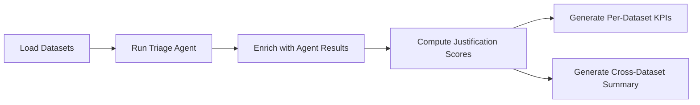

# Benchmark

## Overview

The benchmark tool evaluates the triage agent against human-reviewed findings to measure classification accuracy and justification quality. It runs the agent on each dataset, compares results to analyst ground truth, and produces per-dataset and cross-dataset KPI reports.



## Running the Benchmark

```bash
python run_benchmark.py [OPTIONS]
```

| Option | Default | Description |
|--------|---------|-------------|
| `--model` | `gemini-2.5-pro` | AI model used for triage |
| `--output` | `output` | Root output directory |
| `-v, --verbose` | `false` | Enable debug-level logging |

Each dataset is paired with a Gitleaks CSV report so that secret masking runs as part of the benchmark, mirroring production preprocessing. See [Secret Reports](#secret-reports) below.

## Datasets

Datasets live in `benchmark/datasets/` as JSON files. Each file represents a Checkmarx One project with analyst-reviewed findings:

```json
{
  "project": "CXONE PROJECT NAME",
  "github_url": "GITHUB URL",
  "findings": [
    {
      "id": "FINDING ID",
      "language": "Java",
      "category": "SQL_Injection",
      "severity": "HIGH",
      "complexity": "MEDIUM",
      "analyst_triage": {
        "result": "CONFIRMED",
        "justification": "Direct string concatenation in SQL query"
      }
    }
  ]
}
```

## Secret Reports

Each dataset must be paired with a Gitleaks CSV named after the dataset stem and placed under `benchmark/secret-reports/`:

```
benchmark/datasets/my-project.json
benchmark/secret-reports/my-project.csv
```

The CSV is passed through to `run_triage` as `--gitleaks-report`, so secret masking runs during the benchmark exactly as it does in production. Datasets without a matching CSV are skipped with an error logged to the benchmark run.

Generate a report by cloning the project's source and running [Gitleaks](https://github.com/gitleaks/gitleaks):

```bash
gitleaks detect --source /path/to/repo --report-format csv --report-path benchmark/secret-reports/my-project.csv
```

Neither `benchmark/datasets/` nor `benchmark/secret-reports/` is tracked in git — both are populated locally per benchmarking environment.

## Metrics

### Classification Metrics

These metrics treat triage as a three-class classification problem (`CONFIRMED`, `NOT_EXPLOITABLE`, `REFUSED`).

| Metric | Description |
|--------|-------------|
| Confusion matrix | 3x3 matrix of actual vs predicted counts |
| Precision | Per-class: TP / (TP + FP) |
| Recall | Per-class: TP / (TP + FN) |
| F1 score | Per-class: harmonic mean of precision and recall |
| Sample count | Total number of findings evaluated |

### Legacy Metrics

Accuracy alone is misleading for SAST data — when most findings are not exploitable, a model that dismisses everything still scores high on accuracy while missing every real vulnerability. Use per-class precision and recall above for go/no-go decisions.

| Metric | Description |
|--------|-------------|
| Average accuracy | Percentage of findings where agent matches analyst result |
| Average score | Mean justification quality score (0-4 scale) |
| Average confidence | Mean agent confidence value |

### Dimensional Breakdowns

Metrics are computed per group for each dimension:

- **Language** -- Java, Python, JavaScript, etc.
- **Category** -- SQL_Injection, XSS, etc.
- **Complexity** -- EASY, MEDIUM, COMPLEX
- **Severity** -- CRITICAL, HIGH, MEDIUM, LOW, INFO

Each group includes `sample_count`, classification metrics, and legacy metrics.

### Target Thresholds

The table below defines two tiers for a production go/no-go decision. **Minimum** is the hard gate — a model that fails any minimum threshold should not run unsupervised. **Target** represents the level at which the agent can reliably replace manual first-pass triage.

| Metric | Minimum | Target | Rationale |
|--------|---------|--------|-----------|
| CONFIRMED recall | 0.90 | 0.95 | Missing a real vulnerability is the highest-risk failure mode. |
| CONFIRMED precision | 0.60 | 0.70 | Over-flagging is accepted to protect recall; analysts review CONFIRMED items anyway. |
| NOT_EXPLOITABLE precision | 0.90 | 0.95 | When the agent dismisses a finding, it must be right — no silent misses. |
| NOT_EXPLOITABLE recall | 0.60 | 0.70 | Mirrors CONFIRMED precision — both reflect the accepted over-confirmation rate. |
| Average accuracy | 75% | 85% | Lower than typical ML targets because we deliberately accept over-confirmation. |
| Average score | 2.0 | 2.5 | Justification quality (0-4 scale); ≥ 2.0 means reasoning is at least adequate. |

**Reading the thresholds:**

- **CONFIRMED recall** is the single most important metric. A value below 0.90 means more than 1 in 10 real vulnerabilities are missed — unacceptable for automated post-processing.
- **NOT_EXPLOITABLE precision** is the second priority. When the agent says "not exploitable", that finding leaves the review queue. A false dismissal is a silent miss.
- **CONFIRMED precision** is intentionally relaxed. The agent is tuned to err on the side of confirming when uncertain. This is a fail-safe trade-off: more analyst workload on false positives is preferable to missing real vulnerabilities.
- Precision and recall for **REFUSED** are intentionally omitted. REFUSED is a safety valve — the agent should refuse rather than guess. A high REFUSED rate signals low model confidence, not poor classification.

## Output Files

### Per-Dataset KPIs

Saved to `<output>/<project>/<timestamp>_<model>_benchmark_kpis.json`:

```json
{
  "sample_count": 42,
  "confusion_matrix": {
    "CONFIRMED": {"CONFIRMED": 10, "NOT_EXPLOITABLE": 2, "REFUSED": 0},
    "NOT_EXPLOITABLE": {"CONFIRMED": 1, "NOT_EXPLOITABLE": 25, "REFUSED": 0},
    "REFUSED": {"CONFIRMED": 0, "NOT_EXPLOITABLE": 1, "REFUSED": 3}
  },
  "per_class_metrics": {
    "CONFIRMED": {"precision": 0.91, "recall": 0.83, "f1_score": 0.87}
  },
  "average_accuracy": 90.48,
  "average_score": 2.8,
  "average_confidence": 0.85,
  "language_kpi": [{"Java": {"sample_count": 15, "...":" "}}],
  "category_kpi": [],
  "complexity_kpi": [],
  "severity_kpi": []
}
```

### Cross-Dataset Summary

Saved to `<output>/<timestamp>_<model>_benchmark_summary.json`. Same structure as per-dataset KPIs but aggregated across all datasets.

### Raw Results

Saved to `<output>/<project>/<timestamp>_<model>_benchmark_raw_results.json`. Contains the full enriched dataset with agent triage results and justification scores per finding.
